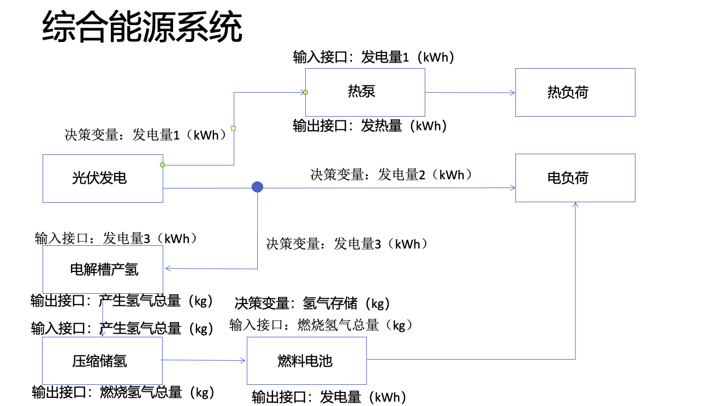

# 光伏+热泵+电解水制氢+储氢罐+燃料电池发电 

## 版本说明（当前版本：v.0.2）
### v.0.1
概括这一版的模型，对比上一版模型这一版模型改了哪些内容？

### v.0.2
概括这一版的模型，对比上一版模型这一版模型改了哪些内容？

## 系统模型结构

## 组件参数
产能（产电）：光伏
能源转化：热泵、电解槽、燃料电池
储能：压缩储氢

### 光伏发电（产能）
组件结构
组件参数
组件相关的数学式
......

### 热泵（能量转化）
......

### 电解槽产氢（能量转化）
......

### 压缩储氢（储能）
......

### 燃料电池（能量转化）
......

### 经济型分析指标
......

## 优化问题
### 目标函数
......

### 决策变量

### 限制条件