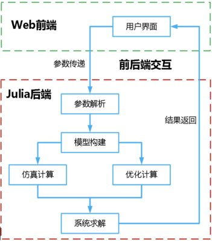

# IES-DOPT 综合能源仿真优化平台开发项目

## 项目结构

```shell
.
├── .github
	└── workflows # github actions 自动化部署配置文件
		└── Documentation.yml # 文档部署配置文件
├── .vscode # vscode配置文件，本地化配置文件，一般不上传
    └── settings.json
├── Docker # Docker文件
	├── Dockerfile # Docker配置文件
	└── nginx.conf # ngnix服务配置文件
├── docs # 项目文档内容
	├── Project.toml # 文档环境配置文件
	├── make.jl # 文档生成配置文件
	└── src # 文档内容
		├── index.md # 介绍文档API
		└── assets 静态资源(如图片)存放文件夹
├── backend #后端代码
	├── src # 项目源码
		├── Controler # 静态仿真PID控制仿真实验
		├── Jumulink  # 动态仿真源码
		├── Optimization # 设计优化源码
			├── data # 数据文件夹
			├── function_Electricity.jl #发电设备
			├── function_Financial.jl #经济计算
			├── function_Gas.jl #产氢气、用气函数
			├── function.jl #补充功能函数
			├── optimize.jl #优化功能重载总文件
			├── optimize_test.jl #优化板块测试文件
			├── simulate.jl #仿真功能重载总文件
			├── simulate_test.jl #仿真板块测试文件
			├── function.jl #补充功能函数
			├── function.jl #补充功能函数
			└── structs.jl # 能源系统组件
		├── Simulaiton # 静态仿真源码
			├── HeatExchanger.jl #顺逆流换热器仿真
			├── Thermodynamics.jl #热力循环仿真
			└── venturiMeter.jl # 文丘里管压力分布仿真
		├── backend.jl # 后端服务总文件
		├── function.jl # 补充功能函数
		├── head.jl # 头文件
		└── test.jl # 测试文件
	├── Dockerfile # 后端镜像本地打包
	├── .dockerignore # docker后端镜像本地打包忽略文件
	└── main.jl # 项目后端启动入口文件，启动服务
├── mock # 前端登录验证文件
├── public  # 全局静态资源
├── .dockerignore # docker忽略文件
├── .gitignore # git提交忽略文件
├── src # 前端源文件
├── package.json # 前端核心配置文件
├── README.md # 项目说明文件
├── Manifest.toml # 依赖配置文件，Julia自动生成，无需手动修改
└── Project.toml # 库环境配置文件
```

## 项目前端技术

### Vue3 框架


采用[vue3](https://vuejs.org/)技术。Vue 是一种用于构建用户界面的渐进式 JavaScript 框架，功能强大且易于使用，且适用于构建交互性的 Web 界面。不同于完全成熟的应用框架，Vue 是由底层到全栈的解决方案中逐层选用的，并提供了一套声明式的、组件化的编程模型，能够高效地开发用户界面。

### Soybean Admin 模版


[Soybean Admin](https://github.com/honghuangdc/soybean-admin) 是一个基于 Vue3、Vite3、TypeScript、NaiveUI、Pinia 和 UnoCSS 的清新优雅的中后台模版，它使用了最新流行的前端技术栈，内置丰富的主题配置，有着极高的代码规范，基于文件的路由系统以及基于 Mock 的动态权限路由，开箱即用的中后台前端解决方案，也可用于学习参考。

## 项目后端技术

### Julia 语言


[Julia](https://julialang.org/)是一门灵活的动态语言，适合用于科学计算和数值计算，并且性能可以与传统的静态类型语言媲美。它拥有着与 C 语言相似的高效运行速度以及类似 Ruby 的灵活动态特性，并且能够像 R 语言一样适用于各种统计分析场景，还如同 Matlab 一样能够对矩阵运算进行高效便捷的处理等，执行速度远远快于解释型语言 Python。Julia 语言在设计之初就针对高性能计算等应用场景进行了深度思考，此外还结合动态类型推导、即时编译等技术，使得运算性能超过了其他动态语言。

## 前后端交互

整体采用前后端分离式的云计算架构。前端为 Web 界面，采用渐进式 JavaScript 框架 Vue3 构建交互与展示；后端为集仿真模块、优化模块，采用新一代开源科学计算编程语言 Julia 开展仿真和优化计算。前后端交互，实现数据可视化。在这种模式下，前端通过发送 HTTP 请求到后端，后端收到请求后进行数据处理运算，并返回相应的数据给前端。最终，前端对返回的数据进行渲染，生成相应的图表和动效，形式上大大提高了软件开发的灵活性，允许前端和后端团队在独立的环境中并行开发，彼此之间不会产生太多的依赖和耦合。这样可以加快开发速度，并且允许团队成员专注于自己擅长的领域。同时，前后端分离的形式使得部署和维护变得更加简单和灵活，也有助于降低系统的复杂性和维护成本。



## 部署服务器

### 前端部署

1.对项目文件进行本地打包生成 dist 文件夹

```
npm run build
```

2.执行命令运行 Dockerfile 文件，对采用 ngnix 服务的前端项目进行 docker 镜像封装

```
docker build -t front_end -f .\docker\Dockerfile .
```

3.对生成的 docker 镜像进行改名操作(dockerhub 用户名/镜像名)

```
docker tag front_end chenghd/front_end
```

4.将镜像 push 到远端 dockerhub 仓库

```
docker push chenghd/front_end
```

5.在服务器端拉取远端镜像

```
docker pull chenghd/front_end
```

6.在服务器端运行 docker 镜像生成 docker 容器

```
docker run --name front -p 80:80 -d chenghd/front_end
```

### 后端部署

1.在本地打包镜像

```
docker build -t backend .
```

2.将后端的本地镜像压缩成 linux 系统可识别的压缩包 .tar

```
docker save  [image] -o image.tar
```

3.将镜像压缩包 tar 上传至服务器（这里可以使用 mobaxterm 终端工具）

https://mobaxterm.mobatek.net/

4.在服务器端对压缩包进行解压

```
docker load -i image.tar
```

5.查看镜像

```
docker images
```

6.运行后端镜像

```
docker run --name [容器名] -p 8080:80 -d [镜像名]
```

## 使用说明(本地开发者模式)

### 先将项目克隆到本地

#### 方法一：使用 GitKraken 进行项目克隆及项目相关操作（推荐）

GitKraken 使用详情请见 https://ai4energy.github.io/Ai4EDocs/dev/WorkFlow/gitworkflow/

如果你是学生可以使用学校的邮箱注册，学生包有 gitkraken 的会员 https://education.github.com/pack

#### 方法二：git 命令行手动操作

首先创建一个空的文件夹用于存放项目，在创建的文件夹中 右键选择 Git Bash Here
输入

```
git init
```

```
git clone https://github.com/ccchhhddd/IES-DOPT.git
```

如果克隆过程存在问题参考这篇文章进行解决
https://blog.csdn.net/m0_63230155/article/details/132070860

### 前端

前端需要下载 node.js 使用 npm 库安装相关库以及运行相关代码

```
npm install ——————配置环境以及安装相关包（在IES-DOPT文件下的环境运行即可）
```

```
npm run dev ——————运行程序
```

### 后端

运行时建议单独进入 backend 环境运行进入包管理模式运行如下代码进行环境激活

```
activate.
```

运行后端（文件路径: backend\src\main.jl）

```
include('main.jl')
```

若出现缺包现象，进入 julia 包管理模式运行如下代码进行自动补全

```
instantiate
```

或可以手动添加所缺的包

```
Pkg.add()
```

初次进行运算时间会略长，请耐心等待

### 文档

本地编译 markdown 文件到 html 请使用如下命令：

```shell
julia --project=docs/ -e 'using Pkg; Pkg.update(); Pkg.instantiate()'
julia --project=docs/ docs/make.jl
```

PS:`./src`中包含了文档中的一些代码与相关资源

## 项目过程

本项目起源于西安交通大学 2023 年大创项目，同时也在[Ai4Energy](https://github.com/ai4energy)开源组织的大力支持下才有了这样的成果。

### 项目第一期时间段: 2023.3——2024.5

在该时间段中共完成了平台版本从 v.1.0 到 v.2.1 的[版本迭代](https://github.com/ccchhhddd/IES-DOPT/releases)。

#### 技术管理

采用[git](https://git-scm.com/)版本控制工具，以及[Gitkraken](https://www.gitkraken.com/)版本控制图形化神器

#### 团队管理

利用[飞书](https://www.feishu.cn/)软件进行团队管理，例如建立甘特图、时间进度表、思维导图等
