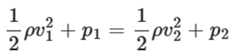
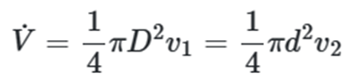
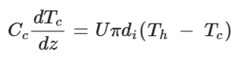
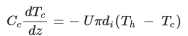
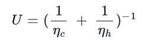
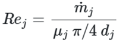
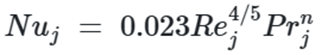
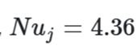
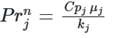
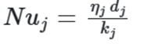

# README

这是 IES-DOPT 综合能源系统优化控制仿真平台的后端，其中包括了仿真、优化和控制等模块。以下是对不同模块中的项目的介绍：

## 热力学循环

### 理想朗肯循环

#### 描述

这是对理想朗肯循环进行的一个仿真模型的后端。需要通过给与"汽轮机出口压力" ,"水泵出口压力"，"锅炉出口温度"三个数据，在这里计算出朗肯循环各器件出入口的状态参数，最后相前端输出"汽轮机入口压力"、 "汽轮机入口温度"、 "汽轮机出口温度"、 "锅炉入口温度"、 "锅炉出口压力" 、"锅炉入口压力"等。

#### 前端输入

前端需要给后端一个 json 文件，文件里要有三组数据，数据结构要与以下字典类型对应

```julia
paras = Dict("汽轮机出口压力" => 100000,
     "水泵出口压力" => 700000,
     "锅炉出口温度" => 701)
```

#### 后端返回

经过计算后会给前端返回一个包含各组件仿真信息的字典类型和 T-S 图数据点的元组，其中有以下数据：

```julia
table = OrderedDict("汽轮机入口压力(pa)" => sol[turbine.in.p][1],
  "汽轮机入口温度(k)" => sol[turbine.in.t][1],
  "汽轮机出口温度(k)" => sol[turbine.out.t][1],
  "锅炉入口温度(k)"=> sol[boiler.in.t][1],
  "锅炉出口压力(pa)"=> sol[boiler.out.p][1],
  "锅炉入口压力(pa)"=> sol[boiler.in.p][1])
```

### 再热朗肯循环

该仿真模拟了有一个再热器的理想朗肯循环，通过输入“冷凝器冷却压力”,“水泵供给压力”, “锅炉出口温度”, “再热器出口温度”, “汽轮机一级出口压力”," 工质"六项数据模拟整个再热循环过程的各项数据。本次仿真输出了"汽轮机一级入口压力(pa)","汽轮机一级入口温度(k)" ,"汽轮机一级出口温度(k)" ,"汽轮机一级出口熵(J/(mol\*k))" ,"锅炉入口温度(k)" , "锅炉出口压力(pa)", "锅炉入口压力(pa)"

#### 前端输入

```julia
"再热循环参数": {
                                                         "冷凝器冷却压力(pa)": 4000,
                                                           "水泵供给压力(pa)": 18000000,
                                                            "锅炉出口温度(k)": 823,
                                                          "再热器出口温度(k)": 720,
                                                     "汽轮机一级出口压力(pa)": 3000000,
                                                                       "工质": "Water"
                 }
```

#### 后端返回

经过计算后会给前端返回一个包含各组件仿真信息的字典类型和 T-S 图数据点的元组，其中有以下数据：

```julia
  table = OrderedDict("汽轮机一级入口压力(pa)" => sol[turbine.in.p][1],
    "汽轮机一级入口温度(k)" => sol[turbine.in.t][1],
    "汽轮机一级出口温度(k)" => sol[turbine.out.t][1],
    "汽轮机一级出口熵(J/(mol*k))" => sol[turbine.out.s][1],
    "锅炉入口温度(k)"=> sol[boiler.in.t][1],
    "锅炉出口压力(pa)"=> sol[boiler.out.p][1],
    "锅炉入口压力(pa)"=> sol[boiler.in.p][1])
```

### 制冷循环

这是一个压缩机制冷循环的仿真，通过输入“压缩机出口压力”,“节气门出口压力”,“工质”三项数据可以模拟出整个循环过程的各项数据。本次仿真输出了"压缩机出口温度(K)" ，"节气门出口温度(K)" ， "压缩机入口温度(K)" ，"节气门入口温度(K)"

#### 前端输入

```julia
"制冷循环参数": {
                                                   "压缩机出口压力(pa)": 1020000,
                                                   "节气门出口压力(pa)": 84000,
                                                                 "工质": "Water"
                                         }
                },
"mode": 3
```

#### 后端返回

经过计算后会给前端返回一个包含各组件仿真信息的字典类型和 T-S 图数据点的元组，其中有以下数据：

```julia
table = OrderedDict("压缩机出口温度(K)" => sol[compressor.out.t][1],
	"节气门出口温度(K)" => sol[throttle.out.t][1],
    "压缩机入口温度(K)" => sol[compressor.in.t][1],
	"节气门入口温度(K)" => sol[throttle.in.t][1])
```

## 流体力学

### 文丘里管仿真

#### 描述

在此模拟中，水流过内径为 200 cm、喉管内径为 100cm 的管道,忽略沿程阻力损失，管道沿线的压力计显示的压力单位为 mH<sub>2</sub>O。此模拟将通过输入介质种类、体积流量、是否有局部摩擦阻力、计算出管道各位置的压力值。管道模型如下图：

#### 输入变量

- 体积流量 Q
- 是否有局部摩擦阻力 friction
- 流动介质 Media

#### 输出量

- 文丘里管各位置的压力值

#### 函数/方程

假定入口处水压为 0.1 个大气压，由方程可计算出各部位压力

伯努利方程： 

体积流量为： 

有摩擦时，局部阻力损失可查表获得。

## 传热学

### 套管式换热器仿真

#### 描述

本仿真计算了套管式换热器中的传热效率和温度曲线，该换热器可在顺流或逆流情况下运行。冷流体流经换热管中心，热流体经环形区域。从下拉菜单中选择热流体类型（液态水、空气）。通过滑块选择热流体和冷流体的流速。热交换器的长度可调整。

#### 输入变量

- 质量流量 Mass flow rates (kg/s): Qhot（热流） Qcold（冷流）
- 热交换器长度 Heat exchanger length (m)： L
- 热流体种类 Hot fluid ： Medialiquid 【water（液态水） air（空气） liquid sodium（液态钠）】
- 流向 Flow type： Flow_type 【parallel（顺流） countercurrent（逆流）】

```julia
{
   "inputdata": {
                       "仿真参数": {
                                              "热流体流量(kg/s)": 4,
                                             "热流体入口温度(K)": 600,
                                              "冷流体流量(kg/s)": 4,
                                             "冷流体入口温度(K)": 300,
                                                 "换热管长度(m)": 10,
                                                    "热流体种类": "Water",
                                                    "冷流体种类": "Water"
                                   }
                },
        "mode": 1
}
```

#### 输出量

- 传热效率 Heat transfer rate
- 流态 flow state
- 温度：Tc（冷流体） Th（热流体）

#### 函数/方程

传热系数计算公式为

顺流：



逆流：



整体传热系数 U，是通过冷水和热水的传热系数 ηc、ηh 计算得出的。公式如下：



传热系数是根据努塞尔特相关系数计算得出的。雷诺数为：



j 可以是冷流也可以是热流。

对于湍流（Re>10^4）则采用 Dittus-Boelter 相关性来计算努塞尔特数：



对于层流



是普朗特数，kj 是导热系数（W/[m k]),加热时 n=0.4，降温时 n=0.3

传热系数计算公式为


