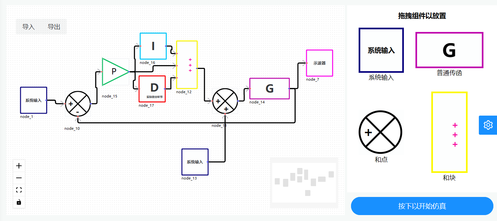
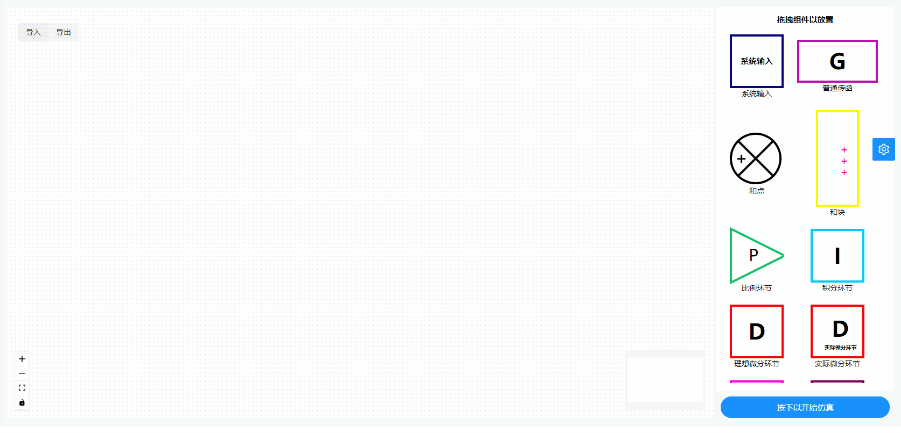
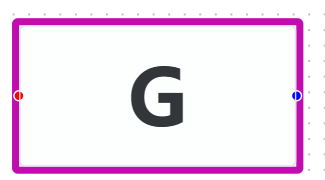
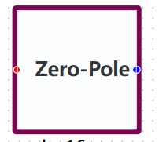
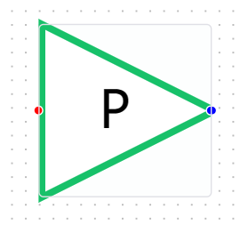
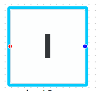
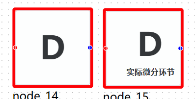
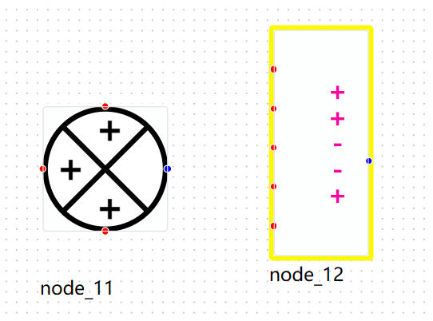
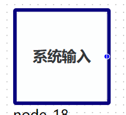
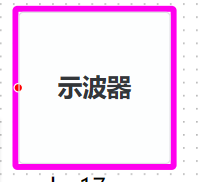

# Jumulink

## 项目概述

本项目基于 Julia 语言开发，以自动控制原理相关理论为基础，对标 MATLAB 进行设计。初步实现了对于以传递函数描述的线性系统的描述，建模，求解与结果的可视化，致力于提供一个交互式的图形化环境及可定制模块库，可对各种时变系统，例如通讯、控制、信号处理、影像处理和图像处理系统等进行设计、模拟、执行和测试，也可以进行基于模型的设计。



## 操作演示



## 原理介绍

### 单输入单输出线性系统

对于单输入单输出的线性系统,以传递函数描述其行为,传递函数的表达式为:


其中$n\geq m$, $Y(s)$为系统输出, $U(s)$为系统输入.采用直接分解法获取状态空间,有:


其中$A_1$为状态方程矩阵, $B_1$为输入方程矩阵, $C_1$为输出方程矩阵, $D_1$为直接传递矩阵.


当 $m=n$时：


当 $m<n$时：


借助 Julia 语言优秀的符号处理与运算机制,我们先定义了多项式,分式等数学结构,并进一步定义它们的四则混合运算.于是就可以很轻松地定义一个传递函数.并通过它的多项式系数获取它的状态空间.并基于状态空间对线性系统进行求解.关于常系数线性常微分方程组的求解,我们使用了 Julia 的开源求解包:$DifferentialEquations.jl$进行求解.

### 多输入多输出线性系统

对于多输入多输出的线性系统,有传递矩阵描述其行为,传递矩阵的表达式为:


其中$G_{ij}(s)$为第$i$个输出与第$j$个输入的传递函数.根据线性微分方程的叠加性,所以,多输入多输出线性系统的每一个输出便可由它关于每一个输入的输出叠加得到.我们利用 2.1 中对单输入单输出线性系统的处理,就能得到多输入多输出线性系统的解.

## 设计思路

我们采用了与 SimuLink 类似的可拖拉拽的 GUI 进行系统的建模,这一行为本身就与控制系统方框图相呼应.于是,自然而然地,我们采用梅森公式来获取传递函数.

梅森公式：


用户在 GUI 中通过拖拽的形式摆放,连接系统组件,我们采用邻接矩阵来储存连接信息.并规定,以矩阵的行表示连接的起点,矩阵的列表示连接的终点.因而,第$i$个组件与第$j$个组件的连接就对应于邻接矩阵的第$i$行第$j$列的元素等于 1,否则等于 0.此外,对于和点处的$+$与$-$,我们规定$+$为 1, $-$为-1.这样,基于邻接矩阵,并利用回溯的寻路算法,我们就可以获取任意一对输入与输出间的前向通道,系统的闭合回路等用于梅森公式计算传递函数的元素,进而计算传递函数.并得到系统的传递矩阵和状态空间,然后得出线性系统的解.并进行可视化分析.

## 设计实现

- 与 MATLAB 不同的是,我们的项目是基于前后端分离思想的网络应用程序.
  - 1.使用$Vue3+TypeScript+Axios$进行拖拉拽网页前端的设计与构建.
  - 2.使用自行编写的多项式运算与分式运算库,并结合 3 中所述梅森公式的算法求得传递函数.
  - 3.利用直接分解法求得状态空间,获得系统的微分方程组.
  - 4.利用$DifferentialEquations.jl$求解线性系统的解.
  - 5.最后通过$Oxygen.jl$实现$Julia$后端与前端网页的数据交互.
- 作为网络程序当然也就具有便捷性与跨平台性.

## 设计内容

目前我们构建了:

- 基本的传递函数组件:以向量形式,按从左到右升幂的形式表达多项式的系数.



- 零极点形式的传递函数组件:以向量的形式表达系统的零点与极点.



- 比例环节:可以设置比例系数.

  - $$G(s)=K$$
    

- 积分环节:可以设置积分时间常数.

  - $$G(s)=\frac{1}{T_is}$$
    

- 理想微分环节:可以设置微分时间常数.
  - $$G(s)=T_ds$$
- 实际微分环节:可以设置微分时间常数与比例系数.

  - $$G(s)=\frac{kT_ds}{1+T_ds}$$
    

- 和点:支持最大 3 端的输入加减求和,可以变更每一端的符号.
- 和块:与 MATLAB 类似,支持最大 5 端的输入加减求和,可以变更每一端的符号.



等基本系统组件.

- 设计了包含三种经典系统输入(阶跃,斜坡,抛物线)的系统输入组件,以及用于可视化的示波器组件.





- 当然,基于我们的架构也可以添加更多组件.这也说明我们的架构是可扩展的,完备的.
- 此外,后端当然也可以单独分离出来,借助$Julia$交互式终端实现类似于 MATLAB 命令行输入的交互方式.

## 设计总结

- 总的来讲,本项目立足于所学知识,结合了前端与后端的设计思想,并结合了 Julia 语言的优秀特性,构建了基于前端拖拽的线性系统建模与求解的网络程序.
- 一方面是对理论的实践,加深了对控制系统的描述与理解,另一方面提高了解决问题的能力.

## 部分代码

```julia
"""
测试模块,定义了符号运算用以测试传函模块的正确性
"""
struct Add
    f::Symbol
    l::Vector
    r::Vector
end

struct Tfs
    n::Vector
    d::Vector
end


Base.:*(x::Tfs, y::Tfs) = Tfs([x.n; y.n], [x.d; y.d])
Base.:*(x::Tfs, y::Number) = Tfs([x.n; y], x.d)
Base.:*(x::Number, y::Tfs) = y * x
function Base.:*(x::Tfs...)
    j = 1
    for k in x
        j *= k
    end
    return j
end
Base.:+(x::Tfs, y::Tfs) = Tfs([Add(:+, [x.n; y.d], [x.d; y.n])], [x.d; y.d])
Base.:+(x::Tfs, y::Number) = Tfs([Add(:+, x.n, y * x.d)], x.d)
Base.:+(x::Number, y::Tfs) = y + x
Base.:/(x::Tfs, y::Tfs) = Tfs([x.n; y.d], [x.d; y.n])
Base.:/(x::Tfs, y::Number) = Tfs(x.n, [y; x.d])
Base.:/(x::Number, y::Tfs) = Tfs([x; y.d], y.n)

function arrange(x::Vector)
    n = [1]
    s = []
    a = []
    for i = 1:length(x)
        if x[i] isa Number
            push!(n, x[i])
        elseif x[i] isa Symbol
            push!(s, x[i])
        else
            push!(a, x[i])
        end
    end
    n = *(n...)
    if n == 1
        return [s; a]
    else
        return [n; s; a]
    end
end

function Base.show(io::IO, x::Add)
    l = arrange(x.l)
    r = arrange(x.r)
    print(io, "($(l...) $(x.f) $(r...))")
    nothing
end

function Base.show(io::IO, x::Tfs)
    n = arrange(x.n)
    d = arrange(x.d)
    println(io, "$(n...)")
    println(io, repeat("-", length(d) * 6))
    println(io, "$(d...)")
    nothing
end
```
