# 离网制氢

## 简介

用户根据如能源供应、负载需求以及储氢容量等约束条件构建能源系统对应的约束场景。输入风光资源数据，设定能源需求和运营等参数后，点击优化按钮，通过算法模拟计算 即可得到风光环境图、系统小时运行图以及经济分析表等结果，以此来分析不同技术方案的成本、效率、能量损失等关键指标，并推导出最佳的设备容量配置。确保该综合能源系统在满足需求的同时，最大程度地减少成本或资源消耗。

## 离网制氢系统图

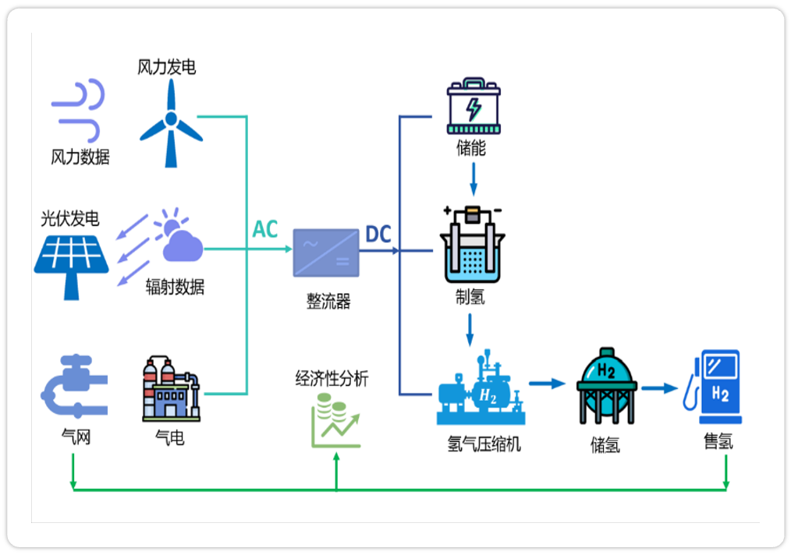

## 离网制氢系统运行逻辑图

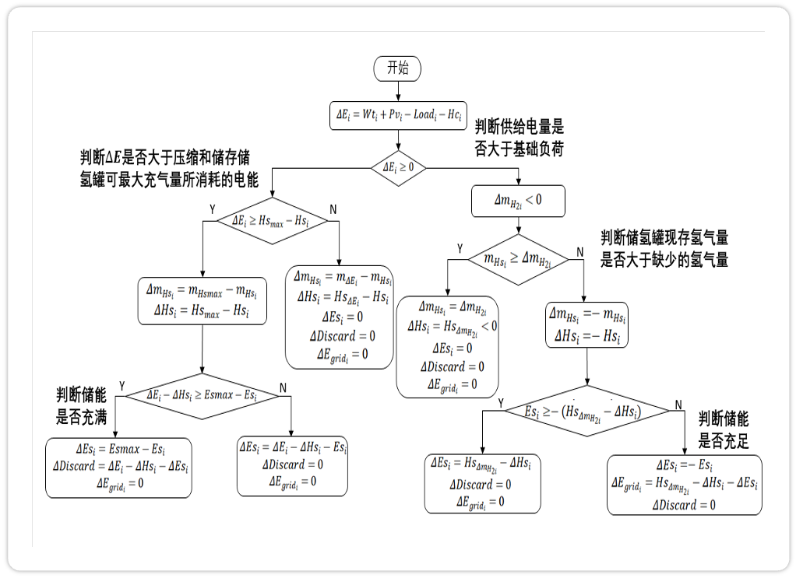

## 平台操作方法及输入输出

### 输入

#### 1.地区选择

如下图所示，导航栏中选择所要进行设计优化的地区，从而在后台可以导入当地的风光资源信息。

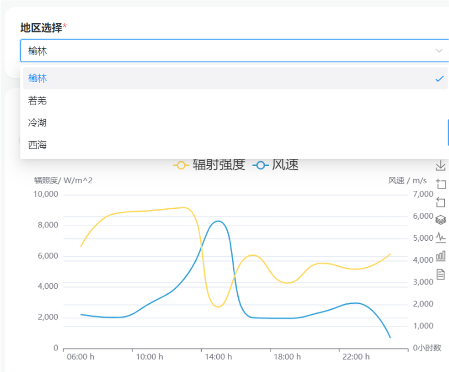

#### 2.经济参数设置

可输入系统的总运行天数以及氢气、天然气的相关价格。

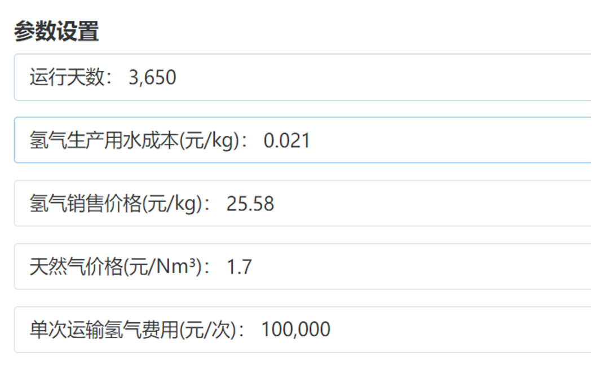

#### 3.优化目标选择

可选择如下图的三个优化目标中的其中一个为目标函数进行求解。

#### 4.选择求解器

如下图的求解器对应的为黑箱优化算法的不同寻优方式，可能会导致所优化求解的结果不相同。

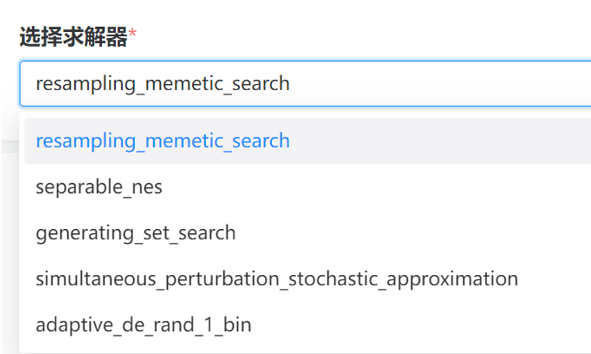

#### 5.选择待优化容量参数

即保持除所选优化容量参数以外的参数只对待优化容量参数进行求解变动

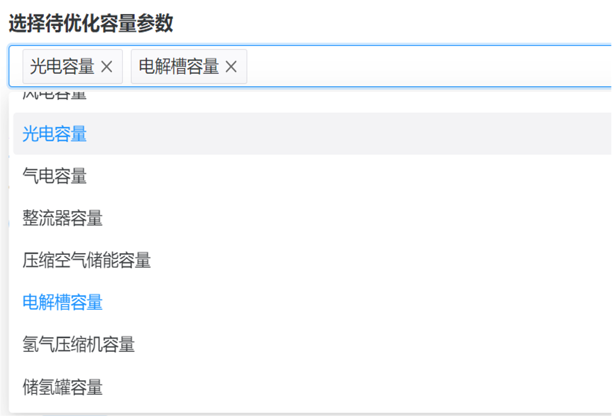

#### 6.设备型号选择

（以风机为例，除风机外还有光伏板、汽轮机、整流器、压缩空气储能、电解槽、氢气压缩机、储氢罐等设备）

可选择如下图两种不同型号参数的设备，同时可对机组数量进行设置。

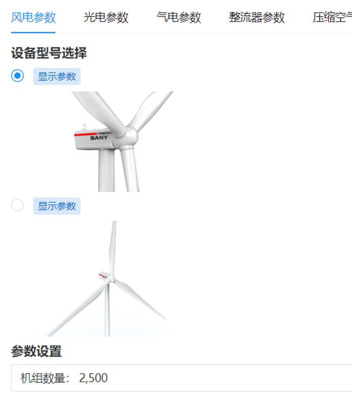

点击显示参数的蓝色按钮，即可查看当前所选设备的详细参数。

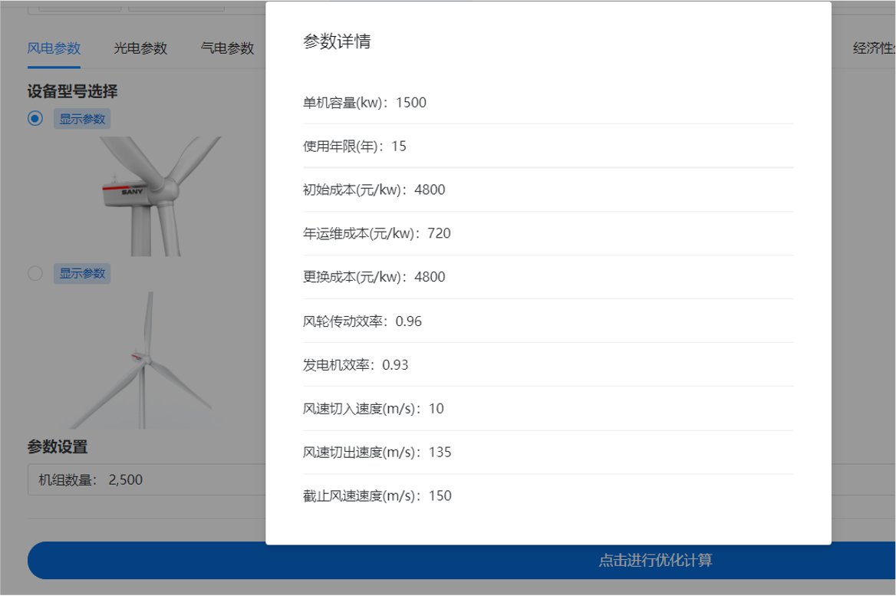

### 输出

#### 1.风光环境图输出

将辐射强度和风速以连续平滑曲线绘制出（支持日数据与周数据查看模式切换）
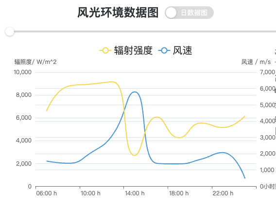

#### 2.系统小时运行图输出

可将风力发电、光伏发电、内燃机发电功率以每小时为最小单位统一绘制在同一张图上。（支持日数据与周数据查看模式切换如下图所示）

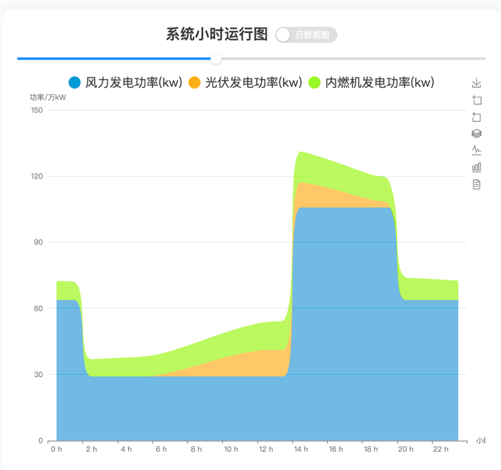

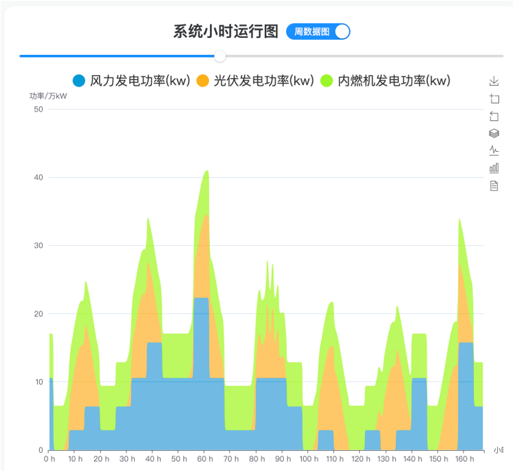

#### 3.制氢图输出

可将系统以每小时为最小时间单位所制氢量绘制在图中（支持日数据与周数据查看模式切换如下图所示）
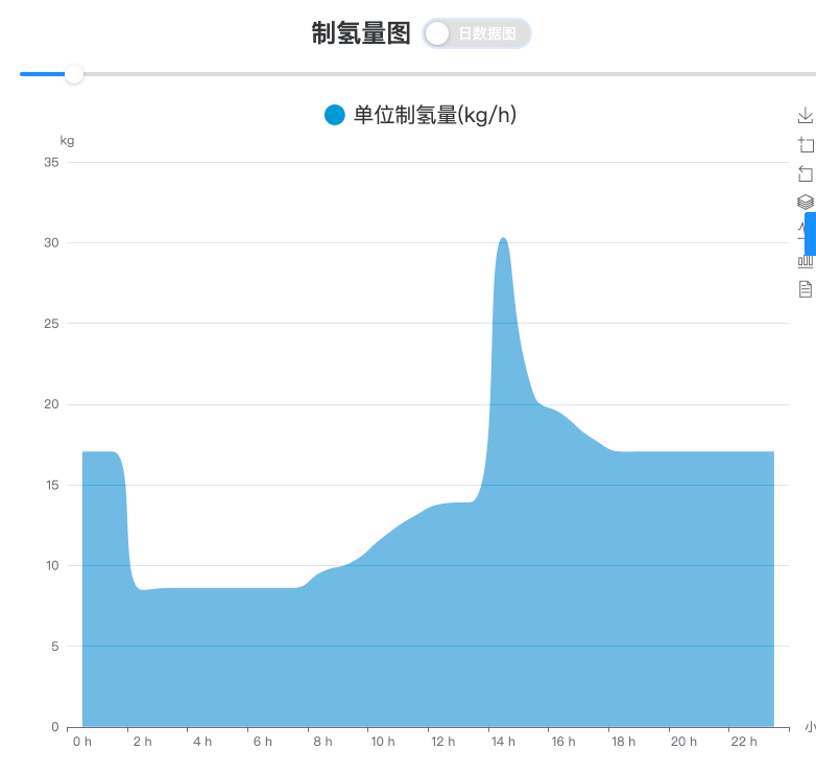

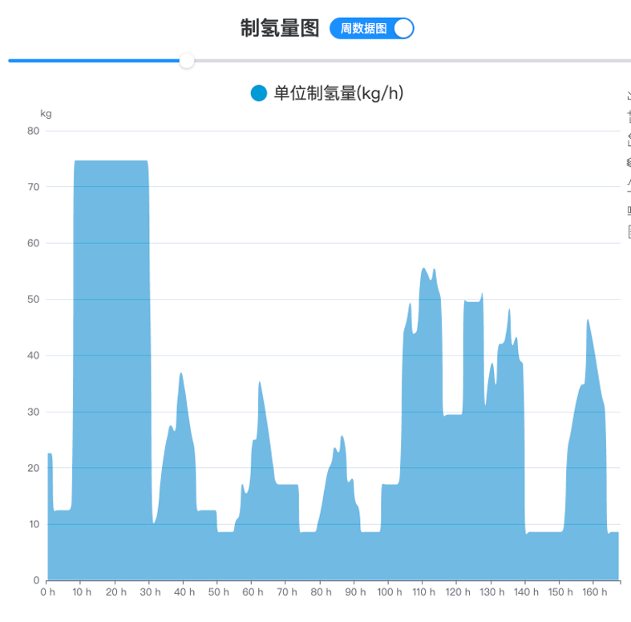

#### 4.规模与经济性表的输出

##### 情况一：每方氢气成本最低为优化目标

第一行为仿真结果，第二行为优化结果。观察到优化后每方氢气成本下降 31.1%

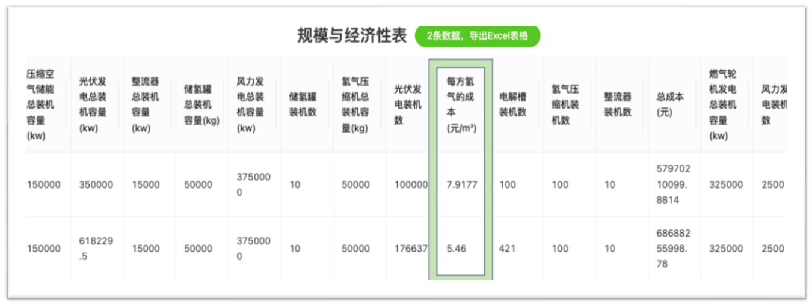

##### 情况二：投资成本限制最大值情况下氢气量产能最大

第一行为仿真结果，第二行为优化结果。观察到优化后成本不变
制氢量提升 13.3%
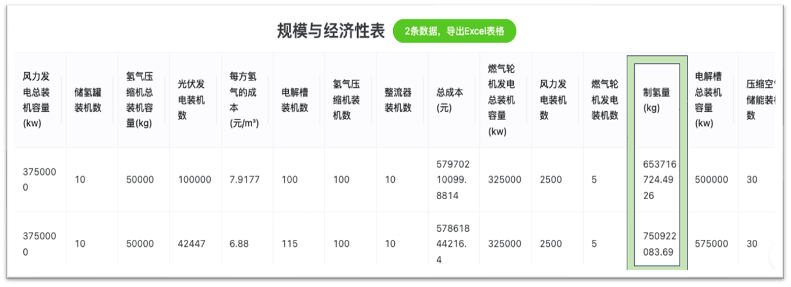

##### 情况三：制氢量限制最小值的情况下总投资成本最低

第一行为仿真结果，第二行为优化结果。观察到优化后最小制氢量总成本减少 2.93%
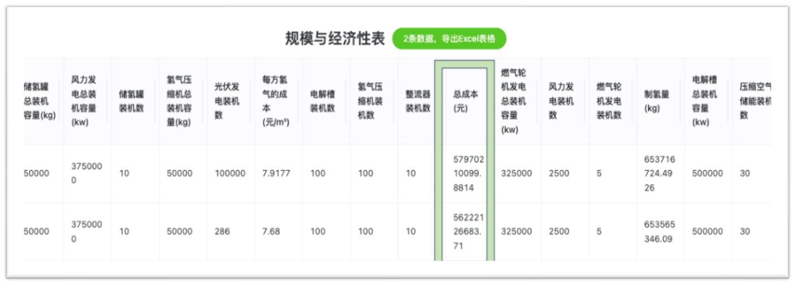
