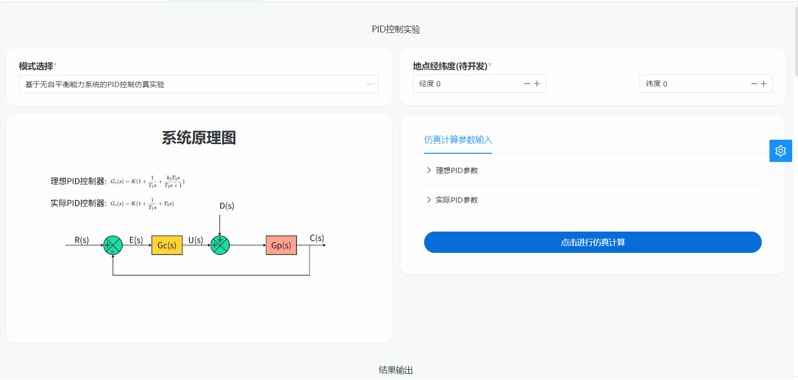
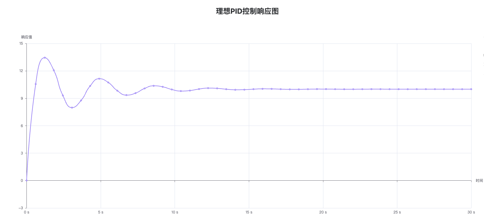
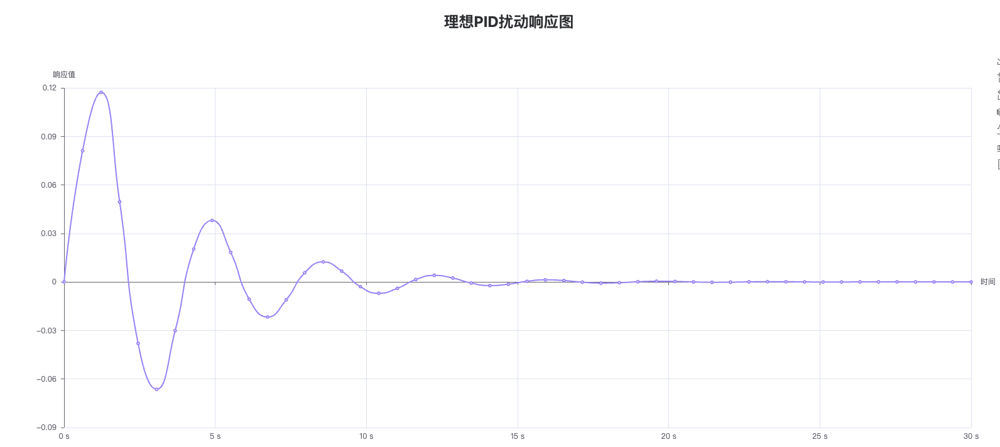
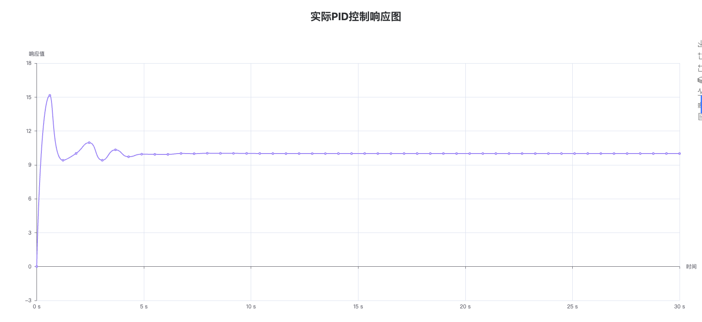
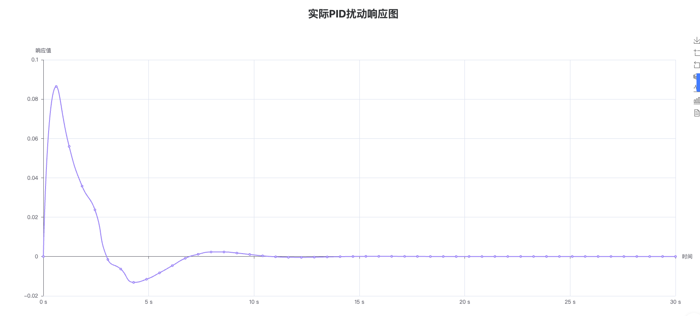

# PID 控制仿真实验

## 简介

该部分通过调节和优化参数，对不同参数组合的仿真结果进行比较，评估 PID（比例-积分-微分）控制器在系统中的性能表现，包括稳态误差、响应时间、抗干扰能力等指标，以找到最佳的 PID 控制器参数，实现更好的控制效果，提高系统的控制精度和稳定性。

## 操作演示



PID 控制仿真基于自动控制原理，利用 Julia 语言对典型的 PID 控制环节进行了建模，并创建了基于该控制器的，控制对象为无自平衡能力系统的二输入(控制，扰动)单输出自动控制系统。同时利用状态空间法进行求解，并进行了可视化处理。

## PID 控制器的系统原理图


用户在仿真软件中选择控制系统仿真模块，并进入设置界面。通过调整 PID 控制器的参数（包括理想 PID 参数和实际 PID 参数）以及其他控制器参数，对系统进行优化。设置完成之后，用户可以点击软件界面上的开始按钮，启动控制系统的仿真过程。仿真软件将模拟系统的动态响应，并输出相应的结果。

## PID 控制结果仿真图









此仿真通过调节 PID 控制器的参数，有助于用户探究不同控制参数以及不同输入(阶跃形式，幅值可调)对该系统稳定性，快速性及准确性的影响，并形成对 PID 控制的感性认知，以及对各控制参数产生的影响的定性理解，从而优化 PID 控制器的参数配置，提高系统的控制性能，实现系统的稳定控制，并预测系统在不同工况下的稳定性。

## 部分代码

```julia
"""
生成控制器传递函数
"""
function transfer_function(x::IdealPid)
    if x.T1 == 0 && x.T2 != 0
        # PD控制
        return Polynomial1([x.K, x.K * x.T2])
    elseif x.T2 == 0 && x.T1 != 0
        # PI控制
        return Fraction1([x.K, x.K * x.T1], [0, x.T1])
    else
        # PID控制
        return Fraction1([x.K, x.K * x.T1, x.K * x.T1 * x.T2], [0, x.T1])
    end
end
function transfer_function(x::ActualPid)
    i = Fraction1([1], [0, x.T1])
    d = Fraction1([0, x.k2 * x.T2], [1, x.T2])
    if x.T1 == 0 && x.T2 != 0
        # PD控制
        return x.K * (1 + d)
    elseif x.T2 == 0 && x.T1 != 0
        # PI控制
        return x.K * (1 + i)
    else
        # PID控制
        return x.K * (1 + i + d)
    end
end

"""
单位正阶跃函数
"""
function positive_step(t; τ₀=0.0)
    if t <= τ₀
        return 0
    else
        return 1
    end
end
```
