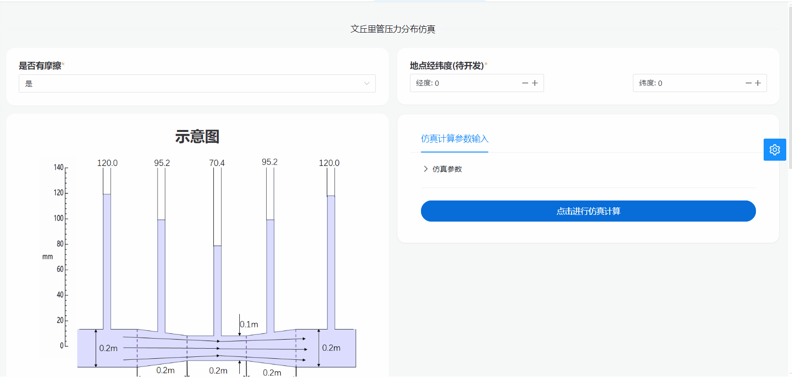
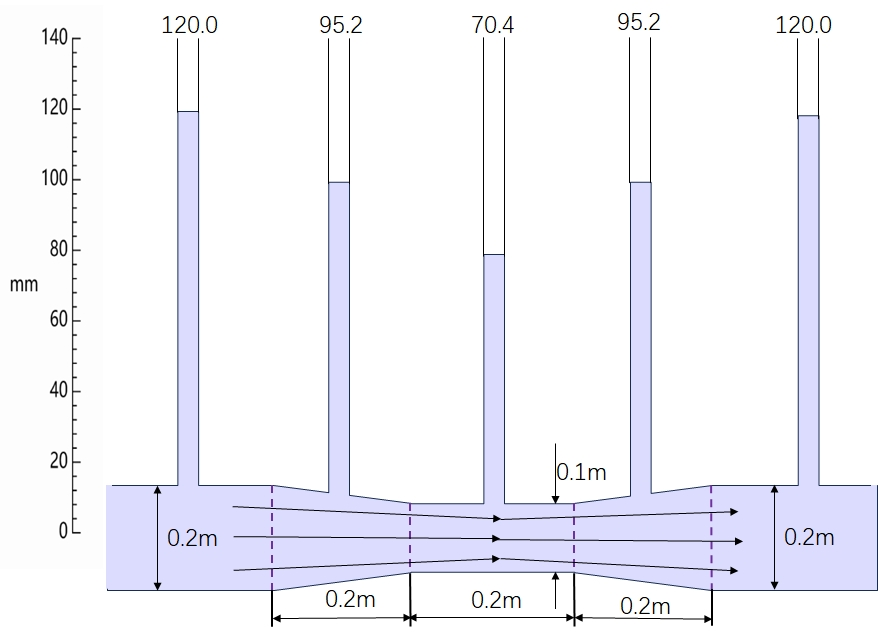
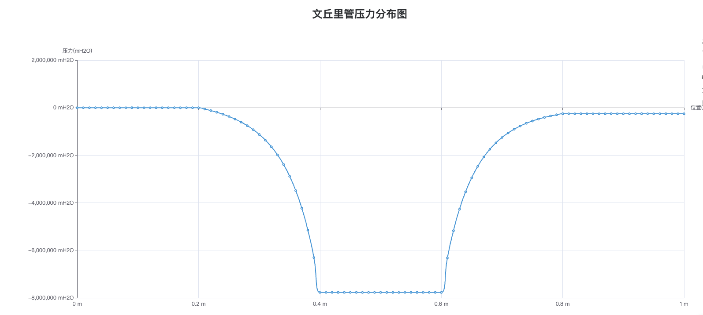

# 文丘里管压力仿真

## 简介

该部分利用了伯努利原理对不同参数（如流量、有无摩擦、介质种类等参数）下文丘里管压力分布进行仿真模拟。通过用户输入的不同参数，可以模拟在该参数约束下文丘里管的状态，从而使用户更直观地了解其压力分布情况。

## 操作演示



## 文丘里管系统原理图



用户可以在仿真软件中选择文丘里管压力仿真模式（是否考虑摩擦阻力）。进入设置界面，选择介质种类（如水、空气），输入流量。设置完成之后，用户可以点击软件界面上的开始按钮，启动控制系统的仿真过程。仿真软件将模拟系统的动态响应，最终得到直观的文丘里管压力分布图。

## 结果仿真图



参考结果图，用户可以了解在此设置条件下管道中不同位置的压力分布情况。通过调整介质种类、体积流量等参数，用户还可以模拟不同工况下的压力情况，并优化管道设计以满足特定的需求。

## 部分代码

```julia
function simulation_Venturi_Meter(; Q,  friction::Bool = false, Media::String = "Water")
  Q = Q isa Number ? Q : parse(Float64, Q)

  #参数
  d = 0.1 #喉管直径
  D = 0.2 #直径
  T = 273.15 + 25 #温度
  P0 = 0.1*1e5 #压力
  ρ = PropsSI("D", "T", T, "P", P0, Media) #密度
  g = 9.8 #重力加速度
  function ΔP(x)
    if friction
      if 0<= x< 0.2
        return 0
      elseif 0.2<= x< 0.4
        return (0.5*ρ*(Q/(π*D^2/4))^2*0.04)*(x-0.2)/0.2
      elseif 0.4<= x< 0.6
        return 0.5*ρ*(Q/(π*D^2/4))^2*0.04
      elseif 0.6<= x< 0.8
        return 0.5*ρ*(Q/(π*D^2/4))^2*(0.04+0.45*(x-0.6)/0.2)
      elseif 0.8<= x<= 1.0
        return 0.5*ρ*(Q/(π*D^2/4))^2*(0.04+0.45)
      end
    else
      return 0
    end
  end

  p = [d, D, P0, ρ, g]

  function h_column(x,p)
    d_x = 0
    if 0<= x< 0.2
      d_x = p[2]
    elseif 0.2<= x< 0.4
      d_x = p[2]-(p[2]-p[1])/0.2*(x-0.2)
    elseif 0.4<= x< 0.6
      d_x = p[1]
    elseif 0.6<= x< 0.8
      d_x = p[1]+(p[2]-p[1])/0.2*(x-0.6)
    elseif 0.8<= x<= 1.0
      d_x = p[2]
    end
    V = Q/(π*d_x^2/4)
    P = 1/2*p[4]*(Q/(π*p[2]^2/4))^2 + p[3] - (1/2*p[4]*V^2 + ΔP(x))
    h = P/p[4]/p[5]
  end

  # 计算 h_column 函数的值
  function calculate_values(p)
    x_values = 0:0.01:1
    return [h_column(x, p) for x in x_values]
  end

  # 绘制图像
  x_values = 0:0.01:1
  y_values = calculate_values(p)
  figure = transposeMatrix(x_values, y_values)

  return figure
end
```
