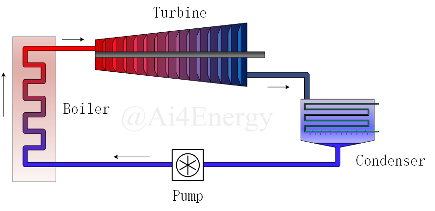
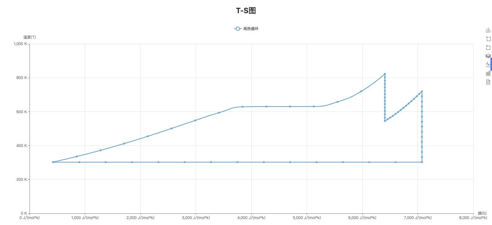

# 蒸汽动力循环仿真

## 简介

该部分支持三个循环（包括朗肯循环、再热循环以及制冷循环）模式的仿真。通过用户输入的参数（如冷凝器冷却压力、锅炉出口温度等），计算出整个循环过程中温度、压力、焓、熵等参数。同时，该部分使用单独描述系统中每个组件并连接在一起的组件化建模方法，极大地提高了建模的效率。用户可以据此比较不同循环参数和组件配置对性能的影响，优化循环设计，并找到达到最佳性能的操作条件。

## 操作演示


## 三个循环仿真

### 1.朗肯循环

#### 朗肯循环模型图



#### 结果仿真图


### 2.再热循环

以再热循环为例，使用者可以根据实际系统特点和需求选择适当的模式。用户需要输入相关的仿真参数，包括冷凝器冷却压力、水泵供给压力等数据。之后，用户可以根据需要设置再热循环系统的运行条件和约束条件。

#### 再热循环模型图


在设置完毕后，用户点击仿真软件中的开始按钮，启动再热循环系统的仿真过程。仿真软件将根据设定的参数和条件，模拟再热循环系统在不同工况下的运行情况，最终输出结果图与包含汽轮机入口压力、汽轮机出入口温度、锅炉入口温度以及锅炉出入口压力等参数的结果输出表。

##### 结果仿真图



用户可以通过生成的 T-S 结果图了解再热循环系统的运行状态，并评估其性能和效率。使用者也可以通过改变锅炉、汽轮机、冷凝器等组件的设计参数对系统进行人工优化，例如优化循环的热能转换效率和降低能量损失。还可以通过调整工作流体的参数，如温度、压力和流量等，来提高系统的整体效率。

### 3.制冷循环

##### 制冷循环模型图


##### 结果仿真图


## 部分代码

```julia
function reheat_rankine(冷凝器冷却压力,
                        水泵供给压力,
                        锅炉出口温度,
                        再热器出口温度,
                        汽轮机一级出口压力,
						工质)

    冷凝器冷却压力 = 冷凝器冷却压力 isa Number ? 冷凝器冷却压力 : parse(Float64,冷凝器冷却压力)
    水泵供给压力 = 水泵供给压力 isa Number ? 水泵供给压力 : parse(Float64,水泵供给压力)
    锅炉出口温度 = 锅炉出口温度 isa Number ? 锅炉出口温度 : parse(Float64,锅炉出口温度)
    再热器出口温度 = 再热器出口温度 isa Number ? 再热器出口温度 : parse(Float64,再热器出口温度)
    汽轮机一级出口压力 = 汽轮机一级出口压力 isa Number ? 汽轮机一级出口压力 : parse(Float64,汽轮机一级出口压力)

    #创建组件...
    @named pump = Pump(P = 水泵供给压力,fluid = 工质)
    @named boiler = Boiler(T = 锅炉出口温度,fluid = 工质)
    @named turbine = Turbine(P = 汽轮机一级出口压力,fluid = 工质)
    @named reboiler = Boiler(T = 再热器出口温度,fluid = 工质)
    @named returbine = Turbine(P = 冷凝器冷却压力,fluid = 工质)
    @named condenser = Condenser(fluid = 工质)

    #构建连接关系
    rc_eqs = [
      connect(pump.out, boiler.in)
      connect(boiler.out, turbine.in)
      connect(turbine.out, reboiler.in)
      connect(reboiler.out, returbine.in)
      connect(returbine.out, condenser.in)
      connect(condenser.out, pump.in)
      D(x) ~ 0
    ]
    @named _rc_model = ODESystem(rc_eqs, t0) #连接关系也需要放到ODESystem中

    # 组件与组件连接关系一起构建系统
    @named rc_model = compose(_rc_model,[turbine, condenser , pump, boiler,reboiler,returbine ])

    # 系统化简
    sys = structural_simplify(rc_model)
    equations(sys) # 查看方程
    # 求解
    prob = ODAEProblem(sys, [0], (0, 0.0))
    sol = solve(prob)

    #println(sol)
    table = OrderedDict("汽轮机一级入口压力(pa)" => sol[turbine.in.p][1],
    "汽轮机一级入口温度(k)" => sol[turbine.in.t][1],
    "汽轮机一级出口温度(k)" => sol[turbine.out.t][1],
    "汽轮机一级出口熵(J/(mol*k))" => sol[turbine.out.s][1],
    "锅炉入口温度(k)"=> sol[boiler.in.t][1],
    "锅炉出口压力(pa)"=> sol[boiler.out.p][1],
    "锅炉入口压力(pa)"=> sol[boiler.in.p][1])

    plot_sys = [pump, boiler, turbine, reboiler, returbine, condenser];
    propx = :s
    propy = :t

    ss = [sol[getproperty(i.out, propx)][1] for i in plot_sys]
    tt = [sol[getproperty(i.out, propy)][1] for i in plot_sys]

    xAxis = collect(range(ss[1], ss[2], 15))
    yAxis = CoolProp.PropsSI.("T", "P", sol[pump.out.p], "S", collect(range(ss[1], ss[2], 15)), 工质)

    append!(xAxis, collect(range(ss[2], ss[3], 15)))
    append!(yAxis,collect(range(tt[2], tt[3], 15)))

    append!(xAxis,collect(range(ss[3], ss[4], 15)))
    append!(yAxis,CoolProp.PropsSI.("T", "P", sol[reboiler.out.p], "S", collect(range(ss[3], ss[4], 15)), 工质))

    append!(xAxis,collect(range(ss[4], ss[5], 15)))
    append!(yAxis,collect(range(tt[4], tt[5], 15)))

    append!(xAxis,collect(range(ss[5], ss[6], 15)))
    append!(yAxis,collect(range(tt[5], tt[6], 15)))

    append!(xAxis,collect(range(ss[6], ss[1], 15)))
    append!(yAxis,collect(range(tt[6], tt[1], 15)))
    # println(xAxis)
    # println(yAxis)
    figure = transposeMatrix(xAxis, yAxis)
    #在本地绘图
    plot_local(figure)
    return figure,table
end
```
