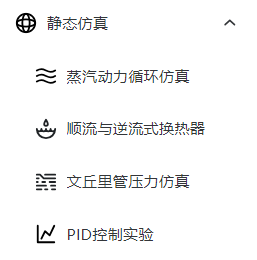
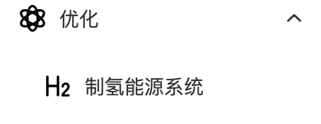

# IES-DOPT 综合能源系统仿真优化平台

## 简介

综合能源系统仿真优化平台基于新一代开源科学计算编程语言 Julia 与 Vue3 前端框架，适用于静态仿真求解能动等专业典型问题，动态仿真求解传递函数问题，优化求解复杂综合能源系统配置寻优问题的仿真优化平台。该平台结合能源、计算机等专业特色，充分利用学科交叉以及先进的综合能源系统建模、仿真、优化与控制思想，不断探索与提升编写工业软件的实践能力，助力“碳达峰、碳中和”双碳目标。

## 平台三大功能

### 1.静态仿真

#### 平台导航栏

#### 简介

**该板块共包括四个场景的仿真，即从热力学、流体力学、传热学、自动控制原理中分别选取了一个经典模型进行仿真求解——蒸汽动力循环仿真、文丘里管压力分布、顺流与逆流式换热器温度分布仿真、基于无自平衡能力系统的 PID 控制仿真。**

**蒸汽动力循环仿真**支持三个循环（包括朗肯循环、再热循环以及制冷循环）模式的仿真。通过用户输入的参数（如冷凝器冷却压力、锅炉出口温度等），计算出整个循环过程中温度、压力、焓、熵等参数。同时，该部分使用单独描述系统中每个组件并连接在一起的组件化建模方法，极大地提高了建模的效率。用户可以据此比较不同循环参数和组件配置对性能的影响，优化循环设计，并找到达到最佳性能的操作条件。

**文丘里管压力分布仿真**利用了伯努利原理对不同参数（如流量、有无摩擦、介质种类等参数）下文丘里管压力分布进行仿真模拟。通过用户输入的不同参数，可以模拟在该参数约束下文丘里管的状态，从而使用户更直观地了解其压力分布情况。

**换热器温度分布仿真**模拟了一个套管式换热器的换热情况，在操作界面可以调整换热器的长度，介质种类，顺逆流，冷、热流入口温度、流量，通过计算会获得换热器不同部位的温度值，整体换热速率等信息，更直观的了解到换热器的换热情况。此仿真过程将换热原理与 ODE 结合，使模型更精准。

**PID 控制仿真**通过调节和优化参数，对不同参数组合的仿真结果进行比较，评估 PID（比例-积分-微分）控制器在系统中的性能表现，包括稳态误差、响应时间、抗干扰能力等指标，以找到最佳的 PID 控制器参数，实现更好的控制效果，提高系统的控制精度和稳定性。

静态仿真板尝试了不同领域知识与软件仿真技术的结合，为后续的动态仿真、综合能源系统仿真优化打下坚实基础。

#### 文档索引

##### [蒸汽动力循环仿真](Static_simulation/蒸汽动力循环仿真.md)

##### [顺流与逆流式换热器仿真](Static_simulation/顺流与逆流式换热器仿真.md)

##### [文丘里管压力仿真](Static_simulation/文丘里管压力仿真.md)

##### [PID 控制仿真实验](Static_simulation/PID控制仿真实验.md)

### 2.动态仿真

#### 平台导航栏

#### 文档索引

##### [Jumulink](Dynamic_simulation/Ai4EJumulink.md)

#### 简介

对标 MATLAB 的 Simulink 进行设计,实现对于以传递函数为基础的线性系统的描述，建模，求解与结果的可视化，提供一个交互式的图形化环境及可定制模块库，可对各种时变系统，例如通讯、控制、信号处理、影像处理和图像处理系统等进行设计、模拟执行和测试。

### 3.优化

#### 平台导航栏

#### 文档索引

##### [离网制氢](Optimization/离网制氢.md)

#### 简介

优化板块实现了离网制氢场景的模型构建、储氢和储能的技术经济性比对、设备容量优化、方案经济性评价、综合落地制氢价格反推等功能要求。其允许用户根据特定的约束条件，如能源供应、负载需求、储氢容量等，构建风光离网制氢系统的约束场景。用户可以输入风能和太阳能资源数据，设定能源需求和运营约束等参数，以便进行后续分析和优化。平台能够根据用户提供的数据，对不同的储氢和储能技术进行经济性比对。可以计算和分析不同技术方案的成本、效率、能量损失等关键指标，帮助用户确定最具经济性的方案。其具备的设备容量优化功能，可以根据用户设定的约束和目标，通过算法和模拟计算，推导出最佳的设备容量配置。
