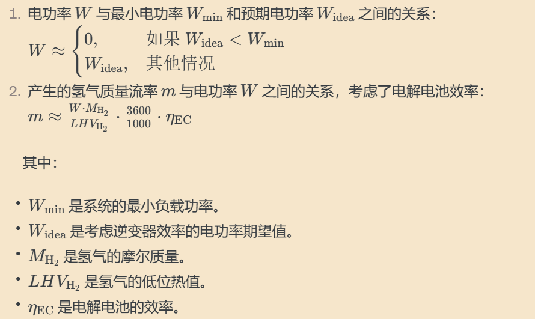

>**如果文档格式出现错误，可以尝试下载文档后，用其他软件打开**

## **src**

### **EnergyFlowComponents.jl**

#### **component**

##### **`Battery`**

储能电池

```julia
# Battery
@component function Battery(; name, 
        E_rated=1000.0, #电池的额定容量
        SoC_start=0.0, #初始充电状态
        SoC_min=0.0, #最小充电状态
        SoC_max=1.0,#最大充电状态。
        SoC_cha_thre=1.0,#充电阈值
        η_loss=0.2/100/24,  #自放能率
        η_cha=0.95,  #充电效率
        η_disc=0.95,  #放电效率
        ΔSoC_thre_cha=1.0,
        ΔSoC_thre_disc=1.0, 
        Δt=1.0, #时间步长
        life_year=10.0,   #预期的运行寿命
        cost_initial=1000.0,  #初始成本
        cost_OM=50.0, #运行和维护成本
        cost_replace=1000.0)#更换成本

    @named bat = EnergyStorage(E_rated=E_rated, SoC_start=SoC_start)
    
    ps = @parameters begin
        E_rated=E_rated #额定容量w
        SoC_start=SoC_start
        SoC_min=SoC_min
        SoC_max=SoC_max
        SoC_cha_thre=SoC_cha_thre # 充能阈值
        η_loss=η_loss   # 自放能率
        η_cha=η_cha     # 充能效率
        η_disc=η_disc   # 放能效率
        ΔSoC_upthre_cha=ΔSoC_upthre_cha     # 充能上限
        ΔSoC_upthre_disc=ΔSoC_upthre_disc   # 放能上限
        ΔSoC_downthre_cha=ΔSoC_downthre_cha     # 充能下限
        ΔSoC_downthre_disc=ΔSoC_downthre_disc   # 放能下限，如最小负载
        Δt=Δt
        life_year=life_year
        cost_initial=cost_initial
        cost_OM=cost_OM
        cost_replace=cost_replace
    end

    extend(ODESystem(Equation[], t, [], ps; name = name), bat)
end


@component function Battery(params::Dict; name)

    ps = @parameters begin
        num_device=get(params, :num_device, 1) # 机组数
        E_device_rated=get(params, :E_device_rated, 1000.0) # 单机容量 kWh
        E_rated=get(params, :E_rated, num_device*E_device_rated) # 装机额定容量 kWh，如果无输入指定则为 机组数*单机功率
        SoC_start=get(params, :SoC_start, 0.0)
        SoC_min=get(params, :SoC_min, 0.0)
        SoC_max=get(params, :SoC_max, 1.0)
        SoC_cha_thre=get(params, :SoC_cha_thre, 0.0)
        η_loss=get(params, :η_loss, 0.2/100/24)
        η_cha=get(params, :η_cha, 0.95)
        η_disc=get(params, :η_disc, 0.95)
        ΔSoC_thre_cha=get(params, :ΔSoC_thre_cha, 1.0)
        ΔSoC_thre_disc=get(params, :ΔSoC_thre_disc, 1.0)
        Δt=get(params, :Δt, 1.0)
        life_year=get(params, :life_year, 10.0)
        cost_initial=get(params, :cost_initial, 1000.0)
        cost_OM=get(params, :cost_OM, 50.0)
        cost_replace=get(params, :cost_replace, 1000.0)
    end

    @named bat = EnergyStorage(E_rated=E_rated, SoC_start=SoC_start)

    extend(ODESystem(Equation[], t, [], ps; name = name), bat)

end


```


##### **`Compressed Hydrogen storage tank`**

高压储氢

```julia
# Compressed Hydrogen storage tank
@component function CompressedH2Tank(; name, 
        E_rated=1000.0, 
        W_comp_per_kgH2=1.0, 
        SoC_start=0.0, 
        SoC_min=0.0, 
        SoC_max=1.0, 
        SoC_cha_thre=1.0,
        η_loss=0.0, 
        η_cha=1.0, 
        η_disc=1.0, 
        ΔSoC_thre_cha=1.0, 
        ΔSoC_thre_disc=1.0, 
        Δt=1.0,life_year=20.0, 
        cost_initial=2300.0, 
        cost_OM=46.0, 
        cost_replace=2300.0)

    @named ht = EnergyStorage(E_rated=E_rated, SoC_start=SoC_start)
    @unpack ΔE, W_consume = ht

    ps = @parameters begin
        E_rated=E_rated # 额定容量，kg
        W_comp_per_kgH2=W_comp_per_kgH2
        SoC_start=SoC_start
        SoC_min=SoC_min
        SoC_max=SoC_max
        SoC_cha_thre=SoC_cha_thre
        η_loss=η_loss
        η_cha=η_cha
        η_disc=η_disc 
        ΔSoC_thre_cha=ΔSoC_thre_cha
        ΔSoC_thre_disc=ΔSoC_thre_disc
        Δt=Δt
        life_year=life_year
        cost_initial=cost_initial
        cost_OM=cost_OM
        cost_replace=cost_replace
    end

    eqs = [
        W_consume ~ W_comp_per_kgH2 * max(0, ΔE)
    ]

    extend(ODESystem(eqs, t, [], ps; name = name), ht)

end


@component function CompressedH2Tank(params::Dict; name)

    ps = @parameters begin
        num_device=get(params, :num_device, 1) # 机组数
        E_device_rated=get(params, :E_device_rated, 1000.0) # 单机容量 kg
        E_rated=get(params, :E_rated, num_device*E_device_rated) # 机组的总容量/装机额定容量 kg，如果无输入指定则为 机组数*单机功率        
        W_comp_per_kgH2=get(params, :W_comp_per_kgH2, 1.0) # 压缩机耗电 kWh/kg H2
        SoC_start=get(params, :SoC_start, 0.0) #储能系统的初始充电状态
        SoC_min=get(params, :SoC_min, 0.0) #储能系统充电状态的最小值
        SoC_max=get(params, :SoC_max, 1.0) #储能系统充电状态的最大值
        SoC_cha_thre=get(params, :SoC_cha_thre, 0.0) #充电状态的阈值
        η_loss=get(params, :η_loss, 0.0) #自放电率
        η_cha=get(params, :η_cha, 1.0) #充电效率
        η_disc=get(params, :η_disc, 1.) #放电效率
        ΔSoC_thre_cha=get(params, :ΔSoC_thre_cha, 1.0) #充电状态变化的阈值
        ΔSoC_thre_disc=get(params, :ΔSoC_thre_disc, 1.0) #放电状态变化的阈值
        Δt=get(params, :Δt, 1.0) #时间步长
        life_year=get(params, :life_year, 20.0) #储能系统的设计寿命
        cost_initial=get(params, :cost_initial, 2300.0) #储能系统的初始成本
        cost_OM=get(params, :cost_OM, 46.0) #储能系统的运维成本
        cost_replace=get(params, :cost_replace, 2300.0) #储能系统的更换成本
    end

    @named ht = EnergyStorage(E_rated=E_rated, SoC_start=SoC_start)
    #@unpack 是 Julia 中的一个宏，可以方便地使用这两个变量而不需要使用 ht.ΔE 和 ht.W_consume。提高了代码的可读性。
    @unpack ΔE, W_consume = ht

    eqs = [
        W_consume ~ W_comp_per_kgH2 * max(0, ΔE)
    ]

    extend(ODESystem(eqs, t, [], ps; name = name), ht)

end

```


##### **`ElectrolyticCell`**

电解池系统

函数中两个方程用于计算电解电池的期望电功率 $W_{\text{idea}}$ 和最小电功率 $W_{\text{min}}$。下面是对它们的分析：

1. **计算期望电功率 $W_{\text{idea}}$：**
   
   - 含义：$W\_{\text{idea}}$ 表示电解电池在考虑逆变器效率的情况下的预期电功率。逆变器效率考虑了在电能转换过程中的能量损失。
   - 计算：取输入电流 $W\_{\text{source}}.u$ 与额定电功率 $E\_{\text{rated}}$ 乘以时间步长 $Δt$ 的较小值。
   - 公式：$W\_{\text{idea}} = \min(W_{\text{source}}.u \cdot \eta\_{\text{inverter}}, E\_{\text{rated}} \cdot \Delta t) $
   - 
   - 注意：这确保了电解电池的电功率不会超过其额定电功率，并考虑了逆变器效率。
   
2. **计算最小电功率 $W_{\text{min}}$：**
   
   - 含义：$W_{\text{min}}$ 表示系统的最小电功率，确保系统在运行时有足够的电力需求。防止电解电池在低负载下运行，可能导致不稳定的运行或性能问题。
   - 计算：取额定电功率 $E_{\text{rated}}$ 乘以时间步长 $Δ t$ 与最小负载效率 $\eta_{\text{load\_min}}$ 的乘积。
   - 公式：$W_{\text{min}} = E_{\text{rated}} \cdot \Delta t \cdot \eta_{\text{load\_min}} $
   - 注意：如果 $W_{\text{idea}}$ 小于 $W_{\text{min}}$，则系统的电功率被设为零，以确保满足最小电功率需求。
   
   

```julia
# ElectrolyticCell
@component function ElectrolyticCell(; name,  
        E_rated=5000.0, #电解电池的额定功率
        Δt=1.0, #时间步长
        η_EC=0.6, #电解电池的效率
        LHV_H2=241, #氢气的低位热值，单位为 kJ/mol H2
        M_H2=2, #氢气的摩尔质量
        η_inverter=1.0, #逆变器的效率
        η_load_min=0.0, #最小负载效率
        life_year=10.0, #设备的设计寿命
        cost_initial=2000.0, #设备的初始成本
        cost_OM=100.0, #设备的运营和维护成本
        cost_replace=2000.0) #设备更换成本

    @named source = EnergySource()
    @unpack W,Q,m = source
    @named W_source = RealInput()


    ps = @parameters(
        Δt = Δt,
        E_rated = E_rated, # 额定功率， kW
        η_EC = η_EC,
        LHV_H2 = LHV_H2,
        M_H2 = M_H2,
        η_inverter = η_inverter, # 逆变器效率，如需使用逆变器，则改变此项及成本
        η_load_min = η_load_min, # 最小负载
        life_year=life_year,
        cost_initial=cost_initial,
        cost_OM=cost_OM,
        cost_replace=cost_replace)

    W_idea = min(W_source.u*η_inverter, E_rated * Δt)
    W_min = E_rated * Δt * η_load_min

    eqs = [
        W ~ ifelse(W_idea < W_min, 0, W_idea)
        m ~ W * M_H2 / LHV_H2 * 3600 / 1000 * η_EC
    ]

    sys = compose(ODESystem(eqs, t, [], ps; name = name),[W_source])

    extend(sys, source)
end


@component function ElectrolyticCell(params::Dict; name)

    @named source = EnergySource()
    @unpack W,Q,m = source
    @named W_source = RealInput()

    ps = @parameters begin
        num_device=get(params, :num_device, 1) # 机组数
        E_device_rated=get(params, :E_device_rated, 5000.0) # 单机容量 kW
        E_rated=get(params, :E_rated, num_device*E_device_rated) # 装机额定容量 kW，如果无输入指定则为 机组数*单机功率
        η_EC=get(params, :η_EC, 0.6)
        LHV_H2=get(params, :LHV_H2, 241)  # kJ/mol H2
        M_H2=get(params, :M_H2, 2.0)    # g/mol H2
        η_inverter=get(params, :η_inverter, 1.0) # 逆变器效率，如需使用逆变器，则改变此项及成本
        η_load_min=get(params, :η_load_min, 0.0) # 最小负载
        Δt=get(params, :Δt, 1.0)
        life_year=get(params, :life_year, 20.0)
        cost_initial=get(params, :cost_initial, 2000.0)
        cost_OM=get(params, :cost_OM, 100.0)
        cost_replace=get(params, :cost_replace, 2000.0)
    end

    W_idea = min(W_source.u*η_inverter, E_rated * Δt)
    W_min = E_rated * Δt * η_load_min

    eqs = [
        W ~ ifelse(W_idea < W_min, 0, W_idea)
        m ~ W * M_H2 / LHV_H2 * 3600 / 1000 * η_EC #kg/h
    ]

    sys = compose(ODESystem(eqs, t, [], ps; name = name),[W_source])

    extend(sys, source)

end

```


##### **`PhotovoltaicCell`**

光伏发电

1. $ W = \frac{\eta}{\eta_{\text{PV\_ref}}} \cdot \frac{\text{GI.u}}{1000} \cdot E_{\text{rated}} \cdot \Delta t \cdot \eta_{\text{inverter}} $

   - $ W $: 电力输出。
   - $ \eta $: 光伏电池效率。
   - $ \eta_{\text{PV\_ref}} $: 光伏电池额定效率。
   - $ \text{GI.u} $: 太阳辐照度。
   - $ E_{\text{rated}} $: 额定功率。
   - $ \Delta t $: 时间步长。
   - $ \eta_{\text{inverter}} $: 逆变器效率。

2. $ \eta = f_{\text{PV}} \cdot \eta_{\text{PV\_ref}} \cdot \left(1 + \lambda \cdot (\text{Ta.u} - Tc_{\text{ref}}) + \lambda \cdot \frac{\text{GI.u} \cdot \text{tau\_alpha}}{5.7 + 3.8 \cdot \text{v.u}} \cdot (1 - \eta_{\text{PV\_ref}})\right) $

   - $ \eta $: 光伏电池效率。
   - $ f_{\text{PV}} $: 降容系数。
   - $ \eta_{\text{PV\_ref}} $: 光伏电池额定效率。
   - $ \lambda $: 温度系数。
   - $ \text{Ta.u} $: 环境温度。
   - $ Tc_{\text{ref}} $: 参考温度。
   - $ \text{GI.u} $: 太阳辐照度。
   - $ \text{tau\_alpha} $: 透射系数。
   - $ \text{v.u} $: 风速。

```julia
# PV:photovoltaic cell
@component function PhotovoltaicCell(; name, 
        E_rated=0.65,  # 额定功率， kW
        Δt=1.0, 
        A=3.1, #光伏电池的面积 m^3
        f_PV=0.8, #降容系数，表示随着时间的推移，光伏电池的性能降低的因素
        η_PV_ref=20.9/100,#光伏电池的额定效率
        λ=-0.34/100, #温度系数，表示光伏电池效率与温度的关系
        Tc_ref=25.0, #参考温度，用于计算温度系数的参考温度
        tau_alpha=0.9, #透射系数，表示透过光伏电池的太阳光的比例
        η_inverter=1.0,# 逆变器效率，如需使用逆变器，则改变此项及成本
        life_year=20.0, 
        cost_initial=3800.0, 
        cost_OM=190.0, 
        cost_replace=3800.0)

    @named source = EnergySource()
    @unpack W,Q,m = source
    @named GI = RealInput() # 光照 Wh/m2
    @named Ta = RealInput() #温度
    @named v = RealInput() #速度

    @variables η(t)=0.0 #η表示光伏电池的效率，即电能输出与太阳能输入之间的比率

    ps = @parameters(
        E_rated=E_rated, # 额定功率， kW
        Δt=Δt,
        A=A, # 不使用
        f_PV = f_PV, #降容系数，表示随着时间的推移，光伏电池的性能降低的因素
        η_PV_ref = η_PV_ref, #光伏电池的额定效率
        λ = λ, #温度系数，表示光伏电池效率与温度的关系
        Tc_ref = Tc_ref, #参考温度，用于计算温度系数的参考温度
        tau_alpha = tau_alpha, #透射系数，表示透过光伏电池的太阳光的比例
        η_inverter = η_inverter, # 逆变器效率，如需使用逆变器，则改变此项及成本
        life_year=life_year,
        cost_initial=cost_initial,
        cost_OM=cost_OM,
        cost_replace=cost_replace)


    eqs = [
        W ~ η / η_PV_ref * GI.u / 1000 * E_rated * Δt * η_inverter
        η ~ f_PV * η_PV_ref * (1 + λ * (Ta.u - Tc_ref) + 
            λ * GI.u * tau_alpha / (5.7 + 3.8 * v.u) * (1 - η_PV_ref))
    ]

    sys = compose(ODESystem(eqs, t, [η], ps; name = name),[GI,Ta,v])

    extend(sys, source)

end

@component function PhotovoltaicCell(params::Dict; name)

    @named source = EnergySource()
    @unpack W,Q,m = source
    @named GI = RealInput() # Wh/m2
    @named Ta = RealInput()
    @named v = RealInput()

    @variables η(t)=0.0

    ps = @parameters begin
        num_device=get(params, :num_device, 1) # 机组数
        E_device_rated=get(params, :E_device_rated, 0.65*1000) # 单机容量 kW
        E_rated=get(params, :E_rated, num_device*E_device_rated) # 装机额定容量 kW，如果无输入指定则为 机组数*单机功率
        A=get(params, :A, 3.1) # m2
        f_PV=get(params, :f_PV, 0.8)  # 降容系数
        η_PV_ref=get(params, :η_PV_ref, 0.209)    # 额定效率
        η_inverter=get(params, :η_inverter, 1.0) # 逆变器效率，如需使用逆变器，则改变此项及成本
        λ=get(params, :λ, -0.34/100) # 温度系数
        Tc_ref = get(params, :Tc_ref, 25.0)
        tau_alpha = get(params, :tau_alpha, 0.9) # 透射系数
        Δt=get(params, :Δt, 1.0)
        life_year=get(params, :life_year, 20.0)
        cost_initial=get(params, :cost_initial, 3800.0)
        cost_OM=get(params, :cost_OM, 190.0)
        cost_replace=get(params, :cost_replace, 3800.0)
    end

    eqs = [
        W ~ η / η_PV_ref * GI.u / 1000 * E_rated * Δt * η_inverter
        η ~ f_PV * η_PV_ref * (1 + λ * (Ta.u - Tc_ref) + 
            λ * GI.u * tau_alpha / (5.7 + 3.8 * v.u) * (1 - η_PV_ref))
    ]

    sys = compose(ODESystem(eqs, t, [η], ps; name = name),[GI,Ta,v])

    extend(sys, source)

end

```


##### **`WindTurbine`**

风力发电

`WindTurbine` 的数学物理方程可以用以下形式表示：

1. 风速计算方程：
   $v_2(t) = v_1(t) \left( \frac{h_2}{h_1} \right)^\alpha$

   这里，$v_2(t)$是风力涡轮机所处高度 $h_2$处的风速，$v_1(t)$是高度 $h_1$ 处的风速，$\alpha$ 是风速梯度指数。

2. 电量产生方程：
   $
   W(t) = k(v_2(t)) \cdot E_{\text{rated}} \cdot \eta_t \cdot \eta_g \cdot \Delta t \cdot \eta_{\text{inverter}}
   $

   这里，$W(t)$ 是在时间 $t$ 产生的电量，$k(v_2(t))$ 是一个与风速相关的函数，$E_{\text{rated}}$ 是额定功率，$\eta_t$ 是涡轮机效率，$\eta_g$ 是机械传动效率，$\Delta t$ 是时间步长，$\eta_{\text{inverter}}$ 是逆变器效率。

3. 风速系数:

   这个函数定义了风速系数 `k(v2)`，其数学物理方程可以按如下方式描述：

   $
   k(v2) = \begin{cases}
   0.0 & \text{如果 } v2 < 3.0 \\
   \frac{-30.639v2^3 + 623.5v2^2 - 3130.4v2 + 4928}{5000} & \text{如果 } 3.0 \leq v2 < 9.5 \\
   1.0 & \text{如果 } 9.5 \leq v2 < 19.5 \\
   \frac{-203.97v2 + 9050.9}{5000} & \text{如果 } 19.5 \leq v2 \leq 25.0 \\
   0.0 & \text{否则}
   \end{cases}
   $

   其中，$v2$ 是风速。这个函数在不同的风速范围内返回不同的值，模拟了风速对风力涡轮机性能的影响。

这些方程描述了风力涡轮机在给定的风速条件下如何产生电量。

```julia
# WT: WindTurbine
@component function WindTurbine(; name, 
    E_rated=5000.0, Δt=1.0, η_t=0.96, η_g=0.93, h1=10.0, h2=135.0, α=1.0/7.0, η_inverter=1.0,
    life_year=20.0, cost_initial=4800.0, cost_OM=720.0, cost_replace=4800.0)

    @named source = EnergySource()
    @unpack W,Q,m = source
    @named v1 = RealInput()

    @variables v2(t)=0.0

    ps = @parameters(
        E_rated = E_rated, # 额定功率， kW
        Δt = Δt,
        η_t = η_t,
        η_g = η_g,
        h1 = h1,
        h2 = h2,
        α = α,
        η_inverter = η_inverter, # 逆变器效率，如需使用逆变器，则改变此项及成本
        life_year=life_year,
        cost_initial=cost_initial,
        cost_OM=cost_OM,
        cost_replace=cost_replace)

    # 计算风速
    
    expr = k(v2) * E_rated * η_t * η_g * Δt * η_inverter # 电量

    eqs = [
        W ~ expr
        v2 ~ v1.u * (h2/h1)^α
    ]

    sys = compose(ODESystem(eqs, t, [v2], ps; name = name),[v1])
    extend(sys, source)
end


function k(v2)
    kv = ifelse(v2 < 3.0, 0.0,
            ifelse(3.0 <= v2 <9.5, (-30.639*v2^3 + 623.5*v2^2 - 3130.4*v2 + 4928)/5000,
                ifelse(9.5 <= v2 <19.5, 1.0,
                    ifelse(19.5 <= v2 <= 25.0, (-203.97*v2 + 9050.9)/5000, 0.0))))

end
@register_symbolic k(v2)

@component function WindTurbine(params::Dict; name)

    @named source = EnergySource()
    @unpack W,Q,m = source
    @named v1 = RealInput()

    @variables v2(t)=0.0
    
    ps = @parameters begin
        num_device=get(params, :num_device, 1) # 机组数
        E_device_rated=get(params, :E_device_rated, 5000.0) # 单机容量 kW
        E_rated=get(params, :E_rated, num_device*E_device_rated) # 装机额定容量 kW，如果无输入指定则为 机组数*单机功率
        η_t=get(params, :η_t, 0.96) #风力涡轮机的机械转化效率
        η_g=get(params, :η_g, 0.93)  #风力涡轮机的电能转换效率
        h1=get(params, :h1, 10.0)    #风速测量高度，单位为米
        η_inverter=get(params, :η_inverter, 1.0) # 逆变器效率，交流电转换为电网接受的电流时的效率。如需使用逆变器，则改变此项及成本
        h2=get(params, :h2, 135.0) #高度
        α = get(params, :α, 1.0/7.0) #风速梯度指数
        Δt=get(params, :Δt, 1.0)
        life_year=get(params, :life_year, 20.0)
        cost_initial=get(params, :cost_initial, 4800.0)
        cost_OM=get(params, :cost_OM, 720.0)
        cost_replace=get(params, :cost_replace, 4800.0)
    end

    # 计算风速
    expr = k(v2) * E_rated * η_t * η_g * Δt * η_inverter # 电量

    eqs = [
        W ~ expr
        v2 ~ v1.u * (h2/h1)^α
    ]

    sys = compose(ODESystem(eqs, t, [v2], ps; name = name),[v1])

    extend(sys, source)

end
```


#### **EnergyFlowComponents**

#####  **`RealInput`**  

根据输入数量的不同，宏创建了对应的变量：

- 如果 `nin` 等于 1，那么创建一个名为 `u` 的变量，表示系统的输入，其初始值为 `u_start`。
- 如果 `nin` 大于 1，那么创建一个名为 `u` 的向量变量，包含 `nin` 个元素，表示系统的输入，其初始值为 `u_start`。

最后，宏返回了一个 `ODESystem` 对象，表示一个差分方程系统。这个系统包含了输入变量 `u`，并且在时间 `t` 上进行演化。这个连接器可以用于将外部实数输入引入到建模系统中，实现对系统的外部控制。

```julia
@connector function RealInput(; name, nin=1, u_start=nin > 1 ? zeros(nin) : 0.0)
    if nin == 1
        @variables u(t) = u_start [input = true]
    else
        @variables u(t)[1:nin] = u_start [input = true]
        u = collect(u)#如果 u 是单个变量（标量），它将被转换为包含一个元素的数组
    end
    #[u...] 的作用是将 u 中的元素展开为一个新的一维数组。这样做的目的可能是确保 ODESystem 的构造函数接受的输入是一个数组，而不管 u 是否是标量或向量。
    ODESystem(Equation[], t, [u...], []; name=name)
end
```


##### **`EnergySource`**

```julia
# 定义能量流电流图中的主动能量生产设备：外界数据输入，输出生产的能量
@component function EnergySource(; name, 
        W_start = 0.0, #电功率初始值
        Q_start = 0.0, #热功率初始值
        m_start = 0.0, #质量流量初始值
        Δt=1.0, #时间步长
        life_year=0.0, #能源生产设备的设计寿命
        cost_initial=0.0, #能源生产设备的初始成本
        cost_OM=0.0, #能源生产设备的运维成本
        cost_replace=0.0) #能源生产设备的更换成本

    sts = @variables begin
        W(t) = W_start #能源生产设备的电功率
        Q(t) = Q_start #能源生产设备的热功率
        m(t) = m_start #能源生产设备产生的质量流率
    end

    ps = @parameters begin
        Δt=Δt
        life_year=life_year
        cost_initial=cost_initial
        cost_OM=cost_OM
        cost_replace=cost_replace
    end

    return ODESystem(Equation[], t, sts, ps; name = name)
end
```


##### **`Secrete`**

根据`user-defined`的日期类型，给光照、风速等类型赋值

```julia
function Secrete(data; name, output_type="user-defined", sampledt=1)
    @named u = RealOutput()
    n = ifelse(output_type == "s", 1,
        ifelse(output_type == "min", 60,
            ifelse(output_type == "hour", 3600,
            ifelse(output_type == "day", 86400, sampledt))))
    eqs = [
        u.u ~ get_datas(t / n, data)
    ]
    compose(ODESystem(eqs, t, [], []; name=name), [u])
end
```


##### **`EnergyBus`**

对所有模型中的产生或消化的能量进行汇总运算

```julia
# 定义能量流电流图中的能量交换总线：多入（源荷）单出（能量平衡关系）
# 输入：提供具体数值的主动电源/负荷；
# 输出E：根据主动电源/负荷数值计算后的能量差值
@component function EnergyBus(; name, 
        names_p::Vector, # 一个包含正向输入名称的向量
        names_n::Vector, #一个包含负向输入名称的向量
        E_start = 0.0) #能量总线的初始能量状态
    
    sts = @variables begin
        E(t) = E_start #总能量 
        sum_p(t)=0.0 #正向输入总和
        sum_n(t)=0.0 #负向输入总和
        ΔE(t) = 0.0 # 经能量存储设备操作后的最终供需能量差值
    end
    
    num_p = length(names_p) #正向输入的数量
    num_n = length(names_n) #负向输入的数量
    ODEs_p = Vector{ODESystem}(undef, num_p) #创建了一个长度为 num_p 的未初始化的 ODESystem 组件数组。这个数组用于存储正向输入的 ODESystem 组件。
    ODEs_n = Vector{ODESystem}(undef, num_n)
    for i in 1:num_p
        ODEs_p[i] = RealInput(name=Symbol(names_p[i]))
    end
    for i in 1:num_n
        ODEs_n[i] = RealInput(name=Symbol(names_n[i]))
    end

    eqs = [
        E ~ sum_p - sum_n
        sum_p ~ sum([p.u for p in ODEs_p]) #正向输入总和
        sum_n ~ sum([n.u for n in ODEs_n]) #负向输入总和
        ]

    return compose(ODESystem(eqs, t, sts, []; name = name), append!(ODEs_p,ODEs_n))
end
```


#### **utils.jl**

#####  **`EnergyStorage`** 

1. **充电至阈值所需的输入能量：**
   $$
   \Delta E_{\text{cha\_to\_thre}} = \max\left(0, \frac{{\text{SoC\_cha\_thre} - \text{SoC}}}{{\eta_{\text{cha}}}} \cdot E_{\text{rated}}\right)
   $$
   
   - 这个方程表示为了将充电状态提高到设定的充电阈值所需的输入能量。计算方式包括充电阈值和当前充电状态之差，乘以充电效率，再乘以额定容量，确保结果不为负。
   
2. **充电和放电功率的下限：**
   $$
    \Delta E_{\text{cha\_min}} = \Delta \text{SoC\_downthre\_cha} \cdot E_{\text{rated}} \cdot \Delta t / \eta_{\text{cha}} 
   $$
   

   - 充电功率的下限，取决于充电状态变化速率的下限、额定容量、充电效率和时间步长。
     $$
     \Delta E_{\text{disc\_min}} = - \Delta \text{SoC\_downthre\_disc} \cdot E_{\text{rated}} \cdot \Delta t \cdot \eta_{\text{disc}} \
     $$
     
   - 放电功率的下限，取决于放电状态变化速率的下限、额定容量、放电效率和时间步长。
   
3. **充电和放电功率的上限：**
   $$
   \ \Delta E_{\text{cha\_max}} = \max\left(\Delta E_{\text{cha\_min}}, \min\left(\max(0, \text{SoC\_max} - \text{SoC}), \Delta \text{SoC\_upthre\_cha}\right) \cdot E_{\text{rated}} \cdot \Delta t / \eta_{\text{cha}}\right) \
   $$
   
   - 充电功率的上限，考虑了充电功率的下限、充电状态变化速率的上限、充电状态的上限以及时间步长。
     $$
      \Delta E_{\text{disc\_max}} = - \max\left(- \Delta E_{\text{disc\_min}}, \min\left(\max(0, \text{SoC} - \text{SoC\_min}), \Delta \text{SoC\_upthre\_disc}\right) \cdot E_{\text{rated}} \cdot \Delta t \cdot \eta_{\text{disc}}\right) 
     $$
     
   - 放电功率的上限，考虑了放电功率的下限、放电状态变化速率的上限、放电状态的下限以及时间步长。
   
4. **总能量变化及外部总线剩余能量：**
   $$
    \Delta E = \text{compare\_energy}(\text{ebus.u}, \Delta E_{\text{cha\_max}}, \Delta E_{\text{disc\_max}}, \Delta E_{\text{cha\_min}}, \Delta E_{\text{disc\_min}}) 
   $$
   
   - 总能量的变化，取决于外部总线的能量以及充放电功率的上下限。
     $$
     \\Delta E_{\text{bus\_left}} = \text{ebus.u} - \Delta E \
     $$
     外部总线上剩余的能量，取决于外部总线的能量和系统总能量的变化。
   
5. **设备实际能量变化及充电状态的演化：**
   $$
   \ \Delta E_{\text{device}} = \text{cal\_energy\_device}(\Delta E, \eta_{\text{cha}}, \eta_{\text{disc}}) \
   $$
   
   - 设备实际能量的变化，考虑了总能量的变化以及充放电效率。
     $$
     \ \frac{\partial \text{SoC}}{\partial t} = (1 - \eta_{\text{loss}}) \left(\frac{\Delta E_{\text{device}}}{E_{\text{rated}}}\right) \
     $$
   - 充电状态的演化，考虑了自放电率、设备实际能量变化和额定容量。

这组方程描述了一个储能系统在外部总线的作用下，通过充电和放电过程进行能量的调节和存储，并考虑了能量转换效率、状态变化速率的上下限等因素。

```julia
@component function EnergyStorage(; name, #能量存储系统的名称。
        E_rated, # 额定能量存储容量。
        SoC_start=0.0, #初始充电状态。
        SoC_min=0.0, #最小充电状态
        SoC_max=1.0, #最大充电状态。
        SoC_cha_thre=0.0, #充电阈值。
        η_loss=0.0, #自放能率，即在放电时的能量损失率。
        η_cha=1.0, #充电效率，表示从外部源荷充电时的能量转换效率
        η_disc=1.0, #放电效率，表示从设备放电时的能量转换效率
        ΔSoC_upthre_cha=1.0, #充电时功率的上限
        ΔSoC_upthre_disc=1.0, #放电时功率的上限
        ΔSoC_downthre_cha=0.0, #充电时功率的下限
        ΔSoC_downthre_disc=0.0,#放电时功率的下限
        Δt=1.0,#时间步长
        life_year=0.0, #预期的运行寿命
        cost_initial=0.0, #初始成本
        cost_OM=0.0, #运行和维护成本
        cost_replace=0.0)#更换成本

    @named ebus = RealInput()  # 上级源荷的能量不匹配量； +：供大于求，充能； -：供低于求，放能
    sts = @variables begin
        ΔE(t)   #净能量变化/对外能力（考虑充放效率损失）,+ 对设备充能，- 设备对外放能
        ΔE_device(t) #装置实际能量变化
        ΔE_cha_to_thre(t) #装置充能到设定充能阈值所需的输入能量 >= 0(要求是非负值)
        ΔE_cha_max(t) #最大充电功率 +
        ΔE_disc_max(t) #最大放电功率 -
        ΔE_cha_min(t) #最小充电功率 +
        ΔE_disc_min(t) #最小放电功率 -
        SoC(t) = SoC_start #充电状态
        ΔE_bus_left(t) = ebus.u #外部总线上剩余的能量
        # 为实现储能所消耗的能源量
        W_consume(t) = 0.0 #能源量
        Q_consume(t) = 0.0 #电荷量
        m_consume(t) = 0.0 #质量
    end

    ps = @parameters begin
        E_rated=E_rated
        SoC_start=SoC_start
        SoC_min=SoC_min
        SoC_max=SoC_max
        SoC_cha_thre=SoC_cha_thre # 充能阈值
        η_loss=η_loss   # 自放能率
        η_cha=η_cha     # 充能效率
        η_disc=η_disc   # 放能效率
        ΔSoC_upthre_cha=ΔSoC_upthre_cha     # 充能上限
        ΔSoC_upthre_disc=ΔSoC_upthre_disc   # 放能上限
        ΔSoC_downthre_cha=ΔSoC_downthre_cha     # 充能下限
        ΔSoC_downthre_disc=ΔSoC_downthre_disc   # 放能下限，如最小负载
        Δt=Δt
        life_year=life_year
        cost_initial=cost_initial
        cost_OM=cost_OM
        cost_replace=cost_replace
    end

    eqs = [
        ΔE_cha_to_thre ~ max(0, SoC_cha_thre - SoC) / η_cha * E_rated

        ΔE_cha_min ~ ΔSoC_downthre_cha * E_rated * Δt / η_cha
        ΔE_disc_min ~ - ΔSoC_downthre_disc * E_rated * Δt * η_disc

        ΔE_cha_max ~ max(ΔE_cha_min, min(max(0, SoC_max - SoC), ΔSoC_upthre_cha) * E_rated * Δt / η_cha)  # 耗电能力
        ΔE_disc_max ~ - max(-ΔE_disc_min, min(max(0, SoC - SoC_min), ΔSoC_upthre_disc) * E_rated * Δt * η_disc) # 放电能力

        ΔE ~ compare_energy(ebus.u, ΔE_cha_max, ΔE_disc_max, ΔE_cha_min, ΔE_disc_min)
        ΔE_bus_left ~ ebus.u - ΔE
        ΔE_device ~ cal_energy_device(ΔE, η_cha, η_disc)
        ∂(SoC) ~ (1-η_loss)* (ΔE_device / E_rated)
    ]

    return compose(ODESystem(eqs, t, sts, ps; name = name), [ebus])

end

```


#####  **`compare_energy`**

- 如果 `ΔE_bus` > `ΔE_cha_max`，则实际能量变化量为 `ΔE_cha_max`。
- 如果 `ΔE_cha_max` >= `ΔE_bus` >= `ΔE_cha_min`，则实际能量变化量为 `ΔE_bus`。
- 如果 `ΔE_cha_min` >`ΔE_bus` > `ΔE_disc_min`，则实际能量变化量为 0。
- 如果 `ΔE_disc_min` >= `ΔE_bus` >= `ΔE_disc_max`，则实际能量变化量为 `ΔE_bus`。
- 在上述条件之外，实际能量变化量为 `ΔE_disc_max`。

这个函数的逻辑是基于不同的能量变化情况返回相应的值。

```julia
function compare_energy(ΔE_bus, ΔE_cha_max, ΔE_disc_max, ΔE_cha_min, ΔE_disc_min)
    # +:充电； -：放电
    ΔE = ifelse(ΔE_bus > ΔE_cha_max, ΔE_cha_max,
            ifelse(ΔE_cha_max >= ΔE_bus >= ΔE_cha_min, ΔE_bus,
                ifelse(ΔE_cha_min > ΔE_bus > ΔE_disc_min, 0,
                    ifelse(ΔE_disc_min >= ΔE_bus >= ΔE_disc_max, ΔE_bus, ΔE_disc_max))))
end
@register_symbolic compare_energy(ΔE_bus, ΔE_cha_max, ΔE_disc_max, ΔE_cha_min, ΔE_disc_min)
```


#####  **`cal_energy_device`**

- 如果 `ΔE` 大于等于 0（充电状态），则实际能量变化 `ΔE_device` 等于 `ΔE * η_cha`，表示充电的能量减去充电效率损失。

- 如果 `ΔE` 小于 0（放电状态），则实际能量变化 `ΔE_device` 等于 `ΔE / η_disc`，表示放电的能量减去放电效率损失。

这个函数的逻辑是基于充电和放电状态的不同应用了不同的效率。这里使用了 `ifelse` 函数，根据 `ΔE` 的正负值，选择相应的计算方式。这个函数返回设备的实际能量变化量 `ΔE_device`。

```julia
function cal_energy_device(ΔE, η_cha, η_disc)
    # +:充电； -：放电
    ΔE_device = ifelse(ΔE >= 0, ΔE * η_cha, ΔE / η_disc)
end
@register_symbolic cal_energy_device(ΔE, η_cha, η_disc)
```


### Scenarios

#### **RE2H2.jl**

##### **`match_vars_RE2H2`**

```julia
# 可再生电力制氢：并网系统：电池模块即为电网
# 优化变量匹配，仿真求解带入
function match_vars_RE2H2(
        opt_var_components::Array, #表示哪些组件需要优化的数组
        optvars, #优化问题中的变量值数组
        opt_var_lower_boundary, #优化变量的下界
        opt_var_upper_boundary; #优化变量的上界
        E_rated_device_components=[650.0,5000.0,5000.0,1000.0,0.05,1000.0]) #PV、WT、AEC、HT、SoC_HT_cha_thre、BAT变量的设备额定功率，用于变量取整

    # opt_var_components = [0,0,1,1,1] # PV,WT,AEC,HT,SoC_HT_cha_thre,BAT是否优化
    # E_rated_device_components：PV,WT,AEC,HT,SoC_HT_cha_thre,BAT变量的设备额定功率，用于变量取整
    vc = @syms(
    PV₊E_rated::Real, #光伏系统的额定功率
    WT₊E_rated::Real, #风力发电系统的额定功率
    AEC₊E_rated::Real, #可再生电力制氢（AEC）系统的额定功率
    HT₊E_rated::Real, #高温储能系统的额定功率
    HT₊SoC_cha_thre::Real, #高温储能系统的充电阈值
    BAT₊E_rated::Real #电池系统的额定功率
    )

    idx = 1
    vs = []

    for i in 1:length(opt_var_components)
        if opt_var_components[i] == 1
            vi = round(optvars[idx]/E_rated_device_components[i])*E_rated_device_components[i]
            vi_lower = opt_var_lower_boundary[idx]
            vi_upper = opt_var_upper_boundary[idx]
            push!(vs, vc[i] => max(vi_lower, min(vi,vi_upper)))
            idx += 1
        end
    end

    vs = [i for i in vs]

    return vs
end
```


##### **`W_AEC_oper`**

函数接受一系列参数，并返回一个计算得到的电能交换值 W_AEC。

函数 `W_AEC_oper` 中的数学方程可以表示为：

$
\begin{align*}
W_{\text{AEC\_max}} &= \min\left(W_{\text{AEC\_rated}}, \frac{(H2L + m_{\text{HT\_cha\_to\_thre}}) \times 33.4}{\eta_{\text{EC}}}, \frac{(H2L + m_{\text{HT\_cha\_max}}) \times 33.4}{\eta_{\text{EC}}}\right) \\
W_{\text{AEC\_min}} &= \max\left(0, \min\left(W_{\text{AEC\_rated}}, \frac{(H2L + m_{\text{HT\_disc\_max}}) \times 33.4}{\eta_{\text{EC}}}\right)\right) \\
W_{\text{AEC}} &= \text{ifelse}\left(W_{\text{RE}} < W_{\text{AEC\_min}}, W_{\text{AEC\_min}}, \text{ifelse}\left(W_{\text{AEC\_min}} \leq W_{\text{RE}} \leq W_{\text{AEC\_max}}, W_{\text{RE}}, W_{\text{AEC\_max}}\right)\right)
\end{align*}
$

其中：
- $W_{\text{AEC\_max}}$ 是 AEC 系统输出功率的上限；
- $W_{\text{AEC\_min}}$ 是 AEC 系统输出功率的下限；
- $W_{\text{AEC}}$ 是 AEC 系统的实际输出功率；
- $W_{\text{AEC\_rated}}$ 是 AEC 系统的额定输出功率；
- $\eta_{\text{EC}}$ 是 AEC 系统的效率；
- $W_{\text{RE}}$ 是可再生能源的电力输出；
- $H2L$ 是氢气的需求量；
- $m_{\text{HT\_disc\_max}}$ 是高温储能系统的最大放电功率；
- $m_{\text{HT\_cha\_to\_thre}}$ 是高温储能系统在满足氢气需求的情况下的最大充电功率；
- $m_{\text{HT\_cha\_max}}$ 是高温储能系统的最大充电功率。

描述了 AEC 系统在不同条件下的输出功率调节策略，确保系统在满足氢气需求、最大充电和放电功率的前提下，有效利用可再生能源。

```julia
# AEC操作策略:对接ELBUS
# HT.ΔE_cha_max:可不用
function W_AEC_oper(W_AEC_rated, #AEC系统的额定输出功率
        η_EC, #AEC系统的效率
        W_RE, #可再生能源（RE）的电力输出
        H2L, #氢气的需求量
        m_HT_disc_max, #高温储能系统的最大充电功率
        m_HT_cha_to_thre, #高温储能系统在满足氢气需求的情况下的最大充电功率
        m_HT_cha_max) #高温储能系统的最大充电功率
    
    W_AEC_max = min(W_AEC_rated, (H2L + m_HT_cha_to_thre) * 33.4 / η_EC, (H2L + m_HT_cha_max) * 33.4 / η_EC) # 由AEC提供H2为主,AEC多发
    W_AEC_min = max(0, min(W_AEC_rated, (H2L + m_HT_disc_max) * 33.4 / η_EC)) # 由HT提供H2为主，AEC少发,m_HT_disc_max:-
    W_AEC = ifelse(W_RE < W_AEC_min, W_AEC_min, # RE不足：购电
        ifelse(W_AEC_min <= W_RE <= W_AEC_max, W_RE,  # RE全消纳
            W_AEC_max)) # RE余电：上网

    return W_AEC
end
@register_symbolic W_AEC_oper(W_AEC_rated, η_EC, W_RE, H2L, m_HT_disc_max, m_HT_cha_to_thre, m_HT_cha_max)
```


##### **`optimization_RE2H2`**

这个目标函数的数学物理方程可以分解为以下几个部分：

1. **LCOE_H2（每千克氢的电力成本）**：

   $ \text{LCOE\_H2} = \frac{{\text{crf} \times \text{cost\_ini} - \text{profit} + \text{cost\_water} + \text{year\_cost\_OM}}}{{\text{m\_H2L} \times (1 - \text{LHSP})}} $

   这里包含了建设和运营成本、水成本等因素。

2. **penalty_Δm（负荷失负率的惩罚项）**：

   $ \text{penalty\_Δm} = 100000.0 \times \max(\text{LHSP\_thre}, \min(1.0, \text{LHSP})) $

   这是一个用于惩罚负荷失负率的项，其中 $\max(\text{LHSP\_thre}, \min(1.0, \text{LHSP}))$ 用于确保在合理范围内。

3. **penalty_RE（风电光伏弃电率的惩罚项）**：

   $\text{penalty\_RE} = 10000.0 \times \max(\text{ar\_RE\_thre}, \min(1.0, \text{ar\_RE})) $

   这是一个用于惩罚风电光伏弃电率的项，其中 $\max(\text{ar\_RE\_thre}, \min(1.0, \text{ar\_RE}))$用于确保在合理范围内。

```julia
# 离网系统：电池模块
# TAG--2：优化
# 求解优化问题
function optimization_RE2H2(
        data_GI::Vector #光照数据（Global Irradiance）的时间序列。
        data_Ta::Vector #环境温度数据的时间序列。
        data_WS::Vector #风速数据的时间序列。
        data_H2L::Vector #氢气需求量的时间序列。
        param_PV::Dict #包含光伏系统相关参数的字典
        param_WT::Dict #包含风力发电系统相关参数的字典
        param_AEC::Dict #包含可再生电力制氢系统相关参数的字典
        param_HT::Dict #包含高温储能系统相关参数的字典
        param_BAT::Dict #包含电池系统相关参数的字典
        opt_var_components::Array #表示哪些组件需要优化的数组，如 [1, 1, 1, 1, 1, 1] 表示所有组件都需要优化
        opt_var_lower_boundary::Array #优化变量的下界
        opt_var_upper_boundary::Array #优化变量的上界
        max_opt_time=60.0 #最大优化时间
        LHSP_thre=0.0 #负荷失负率的阈值
        ar_RE_thre=0.1 #风电光伏弃电率的阈值
        n_sys=20.0 #系统设计寿命
        r=0.05 #贴现率
        construction_life=1.0 #建设寿命
        year_cost_oper=0.0 #电站运营成本（人力成本）
        rate_depreciation=0.0 #折旧率
        rate_discount=0.08 #贴现率
        rate_tax=0.0 #税率
        cost_water_per_kg_H2=0.021 #每千克氢的水成本
        H2price_sale=25.58 #氢气的销售价格 # ￥/kg
        gas_factor=1 #氢气的排放因子
        coal_factor=0.5 #煤的排放因子。
)

    @info "创建组件..."

    @named PV = PhotovoltaicCell(param_PV)   # 50万kW
    @named WT = WindTurbine(param_WT)   # 50万kW, 成本+逆变器
    @named BAT = Battery(param_BAT) # 1e6 
    @named AEC = ElectrolyticCell(param_AEC) # 500000 kWh; 9000kg H2
    @named HT = CompressedH2Tank(param_HT) # 16万立方米 ~ 15000 kg

    @named GI = Secrete(data_GI)
    @named Ta = Secrete(data_Ta)
    @named WS = Secrete(data_WS)
    @named H2L = Secrete(data_H2L)
    
    @named ELBUS = EnergyBus(names_p=["PV", "WT"], names_n=["AEC", "HT"])
    @named H2BUS = EnergyBus(names_p=["AEC"], names_n=["H2L"])

    @info "创建系统..."

    eqs = [
        GI.u.u ~ PV.GI.u#connect(GI.u, PV.GI)
        Ta.u.u ~ PV.Ta.u#connect(Ta.u, PV.Ta)
        WS.u.u ~ PV.v.u#connect(WS.u, PV.v)
        WS.u.u ~ WT.v1.u#connect(WS.u, WT.v1)
        PV.W ~ ELBUS.PV.u#光伏系统的功率输出连接到能量总线
        WT.W ~ ELBUS.WT.u#风力发电系统的功率输出连接到能量总线
        ELBUS.AEC.u ~ W_AEC_oper(AEC.E_rated / AEC.η_inverter, AEC.η_EC, PV.W + WT.W, H2L.u.u,
            HT.ΔE_disc_max, HT.ΔE_cha_to_thre, HT.ΔE_cha_max) #可再生电力制氢系统的电力输出通过一个运算函数 W_AEC_oper 连接到能量总线
        AEC.W_source.u ~ ELBUS.AEC.u + min(0, ELBUS.ΔE)#可再生电力制氢系统的电力输出，同时考虑到电池的存储变化
        ELBUS.HT.u ~ max(0,HT.ΔE)*HT.W_comp_per_kgH2#高温储能系统的功率输出连接到能量总线
        ELBUS.E ~ BAT.ebus.u#电池的电能输出连接到能量总线
        ELBUS.ΔE ~ BAT.ΔE_bus_left#电池的电能变化连接到能量总线
        AEC.m ~ H2BUS.AEC.u#可再生电力制氢系统的氢气质量
        H2L.u.u ~ H2BUS.H2L.u#氢气需求连接到氢气总线
        H2BUS.E ~ HT.ebus.u#高温储能系统的电能输出连接到氢气总线
        H2BUS.ΔE ~ HT.ΔE_bus_left#高温储能系统的电能变化连接到氢气总线
    ]


    @named model = compose(ODESystem(eqs, t, name=:funs),
        [PV, WT, BAT, AEC, HT, GI, Ta, WS, H2L, ELBUS, H2BUS])

    @info "系统化简..."
    sys = structural_simplify(model)#dae_index_lowering(model))

    @info "创建仿真..."
    #(0.0, length(data_H2L) - 1) 是t范围
    prob = ODEProblem(sys, [], (0.0, length(data_H2L) - 1))
    sol = solve(prob, saveat=1.0, Rosenbrock23())

    @info "创建优化..."

    #不同设备额定功率的数组 
    E_rated_device_components = [sol[PV.E_device_rated], 
                                 sol[WT.E_device_rated], 
                                 sol[AEC.E_device_rated], 
                                 sol[HT.E_device_rated], 
                                 0.05,#SoC
                                 sol[BAT.E_device_rated]]
    #计算资本还原系数
    crf = cal_CRF(n_sys, r)

    function obj_bl(opt_var_components::Array, #表示哪些组件需要优化
            optvars,#优化变量的当前取值
            E_rated_device_components,#设备额定功率的数组
            opt_var_lower_boundary,#优化变量的下界
            opt_var_upper_boundary; #优化变量的上界
            prob, #描述了系统的微分方程
            H2BUS, #氢气总线
            H2L,#氢气需求量
            n_sys,# 系统设计寿命
            crf, #资本还原系数
            cost_water_per_kg_H2,#每千克氢的水成本
            LHSP_thre, #负荷失负率的阈值
            ar_RE_thre)#风电光伏弃电率的阈值

        pnew = match_vars_RE2H2(opt_var_components, optvars, opt_var_lower_boundary,opt_var_upper_boundary;
                        E_rated_device_components=E_rated_device_components)

        prob = remake(prob, p=pnew)
        sol = solve(prob, saveat=1.0, Rosenbrock23())

        LHSP = probability_of_loss_of_load_supplied(sol, H2BUS, H2L) # +
        W_RE = sum(sol[ELBUS.sum_p])
        ΔW_RE_abon = sum([i for i in sol[ELBUS.ΔE] if i > 0])

        ar_RE = ΔW_RE_abon / W_RE

        penalty_Δm = 100000.0 * max(LHSP_thre, min(1.0,LHSP)) # thre=-0.0
        penalty_RE = 10000.0 * max(ar_RE_thre, min(1.0,ar_RE)) #thre=0.1

        m_H2L = sum(sol[H2L.u.u])
        cost_ini, year_cost_OM = cost_system_initial_OM([PV, WT, AEC, HT, BAT], n_sys,r, sol)
        profit = 0
        m_H2_AEC = sum(sol[AEC.m])
        cost_water = cost_water_per_kg_H2 * m_H2_AEC
        LCOE_H2 = (crf * cost_ini - profit + cost_water + year_cost_OM) / (m_H2L * (1 - LHSP)) #￥/kg H2

        return ob = LCOE_H2 + penalty_Δm + penalty_RE
    end

    #opt_var_components = [0,0,1,1,1] # PV,WT,AEC,HT,SoC_HT_cha_thre是否优化
    optobj(optvars) = obj_bl(opt_var_components, optvars, E_rated_device_components,opt_var_lower_boundary,opt_var_upper_boundary; 
        prob, H2BUS, H2L,
        n_sys, crf, cost_water_per_kg_H2,
        LHSP_thre, ar_RE_thre)

    # AEC,PV,WT,Bat,HT
    lower = opt_var_lower_boundary
    upper = opt_var_upper_boundary
    # SearchRange = (collect(zip(lower,upper)))

    @info "开始优化..."

    # 调用bboptimize函数进行优化

    res = bboptimize(optobj; SearchRange=(collect(zip(lower, upper))), 
                     MaxTime=max_opt_time,
                     Method=:de_rand_2_bin)

    # MaxSteps = 1e3)#, MaxRelativeFitnessChange = 1e-2) # 

    #res = compare_optimizers(optobj; SearchRange = (collect(zip(lower,upper))), MaxTime = max_opt_time)

    # 打印优化结果摘要
    println(BlackBoxOptim.summary(res))
    # 
    # 获取最优解和最优值
    xopt = best_candidate(res)
    fopt = best_fitness(res)
    println("xopt = $xopt")
    println("fopt = $fopt")

    pnew = match_vars_RE2H2(opt_var_components, xopt,opt_var_lower_boundary,opt_var_upper_boundary; E_rated_device_components)
    prob = remake(prob, p=pnew)
    sol = solve(prob, saveat=1.0, Rosenbrock23())

    @info "系统评价..."
    components = [PV, WT, AEC, HT, BAT]

    W_AEC = sum(sol[AEC.W])#可再生能源系统（AEC）的电力输出
    W_HT = sum([i for i in sol[HT.ΔE] if i > 0])*sol[HT.W_comp_per_kgH2]#高温储能系统（HT）的电力输出
    cost_ini, year_cost_OM = cost_system_initial_OM(components, n_sys,r, sol)#成本
    profit = 0#利润
    m_H2_AEC = sum(sol[AEC.m])#AEC系统产生的氢气的质量
    cost_water = cost_water_per_kg_H2 * m_H2_AEC#水成本

    crf = cal_CRF(n_sys, r)#资本回收因子

    LCOE = (crf * cost_ini - profit + cost_water + year_cost_OM) / (W_AEC + W_HT)#生命周期成本

    LHSP = probability_of_loss_of_load_supplied(sol, H2BUS, H2L)#负荷失负率
    #ar_RE = abandonment_rate_RE(sol, ELBUS)

    H2L_total = sum(sol[H2L.u.u])#总的氢气需求量
    H2L_supplied = H2L_total * (1 - LHSP)#实际满足的氢气需求量
    LCOE_H2 = (crf * cost_ini - profit + cost_water + year_cost_OM) / H2L_supplied  # ￥/kg H2

    m_H2_ab = sum(sol[H2BUS.ΔE])
    m_AEC = sum(sol[AEC.m])
    ar_H2 = m_H2_ab / m_AEC

    W_load = sum(sol[ELBUS.sum_n])#系统的负载电力需求
    W_RE = sum(sol[ELBUS.sum_p])#可再生电力的总产量

    W_AEC = sum(sol[AEC.W])#AEC系统的电力产量
    W_PV = sum(sol[PV.W])#光伏系统的电力产量
    W_WT = sum(sol[WT.W])#风力系统的电力产量
    ΔW_BAT_t = sol[BAT.ΔE]#电池系统的每个时间步的电量变化
    ΔW_to_BAT = sum([i for i in ΔW_BAT_t if i > 0])#电池系统充电的总量
    ΔW_from_BAT = sum([i for i in ΔW_BAT_t if i < 0])#电池系统放电的总量

    ΔW_RE_abon = sum([i for i in sol[ELBUS.ΔE] if i > 0])#弃电的总量

    ar_RE = ΔW_RE_abon / W_RE#可再生电力弃电率，即弃电的总量与可再生电力的总产量之比。

    # 经济性评价
    cost_ini_components = []#每个组件的初始投资成本
    cost_OM_components = []#每个组件的年运营和维护成本
    for c in components
        cost_ini_i = sol[c.cost_initial] * sol[c.E_rated]
        n_replace = sol[c.life_year]
        while n_replace < n_sys
            cost_ini_i += sol[c.cost_replace] * sol[c.E_rated] * (1 + r)^n_replace

            n_replace += n_replace
        end
        cost_OM_i = sol[c.cost_OM] * sol[c.E_rated]

        push!(cost_ini_components, cost_ini_i)
        push!(cost_OM_components, cost_OM_i)
    end

    cost_initial = sum(cost_ini_components)#所有组件初始投资成本的总和
    year_cost_main = sum(cost_OM_components)#所有组件年运营和维护成本的总和
    revenue_H2 = H2price_sale * H2L_supplied#制氢销售的收入
                                                                   #ceil 是向上取整的函数
    operation_life = ceil(n_sys)#系统的操作寿命
    construction_life = ceil(construction_life)#系统的建设寿命
    year_revenue = revenue_H2 + profit - cost_water#年总收入，包括氢气销售收入、利润和水成本

    NPV, IRR, payback = financial_evaluation(cost_initial,
        year_cost_oper, year_cost_main, year_revenue,
        operation_life, construction_life,
        rate_depreciation=rate_depreciation,
        rate_discount=rate_discount,
        rate_tax=rate_tax)#净现值、内部收益率和回收期，通过调用 financial_evaluation 函数进行计算


    dict_res = OrderedDict(
        "风电（万千瓦）" => sol[WT.E_rated] / 1e4,
        "光伏（万千瓦）" => sol[PV.E_rated] / 1e4,
        "制氢（万千瓦）" => sol[AEC.E_rated] / 1e4,
        "储氢（吨）" => sol[HT.E_rated] / 1e3,
        "储氢（万立方米）" => sol[HT.E_rated] / 1e4 / 0.089,
        "储氢设备充能阈值" => sol[HT.SoC_cha_thre],
        "锂电池（万千瓦时）" => sol[BAT.E_rated] / 1e4,
        "系统设计寿命（年）" => n_sys,
        "光伏电量（亿千瓦时）" => W_PV / 1e8,
        "风电电量（亿千瓦时）" => W_WT / 1e8,
        "风电光伏电量（亿千瓦时）" => W_RE / 1e8,
        "风电光伏利用率（%）" => (1 - ar_RE) * 100,
        "风电光伏弃电率（%）" => ar_RE * 100,
        "风光发电制氢电量（亿千瓦时）" => (W_RE - ΔW_RE_abon) / 1e8,
        "制氢用电量（亿千瓦时）" => W_AEC / 1e8,
        "储氢用电量（亿千瓦时）" => W_HT / 1e8,
        "制氢设备利用小时数（小时）" => sum([1 for i in sol[AEC.W] if i > 0]),
        "制氢量（万吨）" => m_AEC / 1e7,
        "氢气负荷（万吨）" => H2L_total / 1e7,
        "氢负荷失负率（%）" => LHSP * 100,
        "静态总投资（亿元）" => cost_ini / 1e8,
        "年度售氢盈利（亿元）" => revenue_H2 / 1e8,
        "年度运维成本（亿元）" => year_cost_OM / 1e8,
        "年度用水成本（亿元）" => cost_water / 1e8,
        "制氢价格（元/kg）" => LCOE_H2,
        "制氢价格（元/方）" => LCOE_H2 * 0.089,
        "度电成本（元/kWh）" => LCOE,
        "项目净现值NPV（亿元）" => NPV / 1e8,
        "内部收益率IRR" => IRR,
        "投资回收期（年）" => payback
    )

    return getSolution(sol, [PV.W, WT.W, AEC.W, BAT.ΔE]), dict_res
end
```


#### **Scenarios.jl**

##### **`Scenarios`**

定义了一个名为 `Scenarios` 的模块。将相关的功能集中在一个地方，方便管理和维护

```julia
module Scenarios

using ModelingToolkit, DifferentialEquations
using ..HRESDesign, ..HRESDesign.EnergyFlowComponents
using BlackBoxOptim, ActuaryUtilities, OrderedCollections
using DataFrames, CSV

include("utils.jl")
include("RE2H2.jl")


export simulation_RE2H2,
       optimization_RE2H2,
       simulation_RE2Channel,
       optimization_RE2Channel

export save_csv

end
```


#### **utils.jl**

##### **`cal_CRF`**

该函数用于计算资本还原系数（Capital Recovery Factor，CRF）。CRF 是一种考虑了贴现率和设备寿命的财务指标，用于估算设备每年产生的资本还原金额。

函数接受两个参数：
- `n`：设备的寿命（年）。
- `r`：贴现率。

计算公式为：

$\text{CRF} = \frac{r \cdot (1+r)^n}{(1+r)^n - 1} $

```julia
function cal_CRF(n,r)
    crf = r*(1+r)^n / ((1+r)^n-1)
end
```


##### **`probability_of_loss_of_load_supplied`**

计算失负荷供电率 LHSP，它表示电能储能系统无法满足负荷需求的时间占总时间的比例

```julia
function probability_of_loss_of_load_supplied(sol, BUS, Load)
    ΔE_BUS_t = sol[BUS.ΔE] #每个时间步的能量变化
    E_Load = sum(sol[Load.u.u]) #计算总的负荷能量需求
    ΔE_BUS_lack = sum([i for i in ΔE_BUS_t if i < 0]) #计算电能储能系统中能量不足的时间，通过筛选 ΔE_BUS_t 中小于零的值并求和得到
    LHSP = -ΔE_BUS_lack/E_Load#计算失负荷供电率 LHSP
    return LHSP
end
```


##### **`cost_system_initial_OM`**

```julia
function cost_system_initial_OM(components::Array,n_sys,r,sol)
    cost_ini_components = []
    cost_OM_components = []
    for c in components
        cost_ini_i = sol[c.cost_initial]*sol[c.E_rated]
        n_replace = sol[c.life_year]
        while n_replace < n_sys
            cost_ini_i += sol[c.cost_replace] * sol[c.E_rated] * (1+r)^n_replace

            n_replace += n_replace
        end
        cost_OM_i = sol[c.cost_OM] * sol[c.E_rated]

        push!(cost_ini_components,cost_ini_i)
        push!(cost_OM_components, cost_OM_i)
    end
```


##### **`financial_evaluation`**

这是一个用于财务评估的函数，接受一些关键的财务参数，并计算净现值（NPV）、内部收益率（IRR）和投资回收期（payback）

```julia
function financial_evaluation(
        cost_initial, #初始投资成本
        year_cost_oper, #每年的运营成本
        year_cost_main, #每年的主要成本
        year_revenue, #每年的收入
        operation_life, #运营寿命
        construction_life; #建设寿命
        rate_depreciation=0.05, #折旧率，默认为0.05
        rate_discount=0.08, #贴现率，默认为0.08
        rate_tax=0.25) #税率，默认为0.25

    operation_life = Int(operation_life)
    construction_life = Int(construction_life)
    #vcat 是 Julia 编程语言中用于垂直（纵向）连接数组的函数。它将给定的数组按行连接成一个新的数组。
    annual_investment_cost = vcat(cost_initial/construction_life .* ones(construction_life),zeros(operation_life))
    annual_revenue = vcat(zeros(construction_life),  year_revenue .* ones(operation_life))
    annual_operating_cost = vcat(zeros(construction_life), (year_cost_oper + year_cost_main) .* ones(operation_life))
    depreciation = vcat(zeros(construction_life), cost_initial * rate_depreciation .* ones(operation_life)) # 折旧

    cashflows = (annual_revenue .- depreciation .- annual_operating_cost) .* (1-rate_tax) .- annual_investment_cost
    times = collect(0:length(cashflows)-1)

    NPV = present_value(rate_discount, cashflows, times)
    # 0.057483
    IRR = irr(cashflows)
    payback = breakeven(rate_discount, cashflows,times)

    if IRR === nothing
        println("内部收益率计算失败")
        IRR = -1
    else
        IRR = ActuaryUtilities.FinanceCore.rate(IRR)
    end

    if payback === nothing
        println("投资回收期超出项目期限")
        payback = -1
    end

    return NPV, IRR, payback
end
```


##### **`getSolution`**

获取最终解sol中的vars值

```julia
function getSolution(sol, vars)
    return Dict(
        string(v) => sol[v] for v in vars
    )
end
```


### **HRESDesign.jl**

##### **`HRESDesign`**

定义了自变量t，微分函数∂

```julia
module HRESDesign
using ModelingToolkit
@variables t
∂ = Differential(t)

export t, ∂

include("EnergyFlowComponents/EnergyFlowComponents.jl")
include("Scenarios/Scenarios.jl")

end # module HRESDesign
```

### **funcAPIs.jl**

```julia
@info "导入 funcAPIs.jl..."
# 生成前端图表数据
getFigureData(sol, ::Val{1}) = Dict(
    "储能供电量" => map(x -> x < 0 ? round(-x, digits=1) : 0, sol["BAT₊ΔE(t)"]),
    "风力发电量" => round.(sol["WT₊W(t)"], digits=1),
    "光伏发电量" => round.(sol["PV₊W(t)"], digits=1),
    "电解用电量" => round.(-sol["AEC₊W(t)"], digits=1),
    "储能充电量" => map(x -> x >= 0 ? round(-x, digits=1) : 0, sol["BAT₊ΔE(t)"]),
    "储氢用电量" => map(x -> x >= 0 ? round(x, digits=1) : 0, sol["HT₊ΔE(t)"]),
)


# 生成前端表格数据[{items: "风电（万千瓦）", value: "90.82801252034335"}, ...]  
getTableData(table) = [Dict("items" => k, "value" => round(v, digits=2)) for (k, v) in table]


#=
多重派分代号：
1：风光制氢离网
=#
#根据传入的参数和优化标志，调用 optimization_RE2H2 函数，进行风光制氢离网系统的优化
optimization(paras, isOptList, ::Val{1}) = optimization_RE2H2(
    S3_data_GI, S3_data_Ta, S3_data_WS, S3_data_H2L,
  Dict(:E_rated => paras["光伏参数"]["装机容量（千瓦）"],
        :E_device_rated => paras["光伏参数"]["单位设备容量（kW）"],
        :η_inverter => paras["光伏参数"]["综合效率"],
        :life_year => paras["光伏参数"]["产品寿命（年）"],
        :cost_initial => paras["光伏参数"]["投资成本（￥/kW）"],
        :cost_OM => paras["光伏参数"]["运维成本（￥/kW）"],
        :cost_replace => paras["光伏参数"]["替换成本（￥/kW）"]),
    Dict(
        :E_rated => paras["风电参数"]["装机容量（千瓦）"],
        :E_device_rated => paras["风电参数"]["单位设备容量（kW）"],
        :η_inverter => paras["风电参数"]["综合效率"],
        :life_year => paras["风电参数"]["产品寿命（年）"],
        :cost_initial => paras["风电参数"]["投资成本（￥/kW）"],
        :cost_OM => paras["风电参数"]["运维成本（￥/kW）"],
        :cost_replace => paras["风电参数"]["替换成本（￥/kW）"]),
    Dict(
        :E_rated => paras["电解槽参数"]["装机容量（千瓦）"],
        :E_device_rated => paras["电解槽参数"]["单位设备容量（kW）"],
        :η_inverter => paras["电解槽参数"]["综合效率"],
        :life_year => paras["电解槽参数"]["产品寿命（年）"],
        :cost_initial => paras["电解槽参数"]["投资成本（￥/kW）"],
        :cost_OM => paras["电解槽参数"]["运维成本（￥/kW）"],
        :cost_replace => paras["电解槽参数"]["替换成本（￥/kW）"]),
    Dict(
        :E_rated => paras["储氢参数"]["装机容量（吨）"],
        :E_device_rated => paras["储氢参数"]["单位设备容量（kW）"],
        :SoC_cha_thre => paras["储氢参数"]["充能阈值"],
        :life_year => paras["储氢参数"]["产品寿命（年）"],
        :cost_initial => paras["储氢参数"]["投资成本（￥/kW）"],
        :cost_OM => paras["储氢参数"]["运维成本（￥/kW）"],
        :cost_replace => paras["储氢参数"]["替换成本（￥/kW）"]),
    Dict(
        :E_rated => paras["储能参数"]["装机容量（千瓦时）"],
        :E_device_rated => paras["储能参数"]["单位设备容量（kW）"],
        :SoC_cha_thre => paras["储能参数"]["充能阈值"],
        :life_year => paras["储能参数"]["产品寿命（年）"],
        :cost_initial => paras["储能参数"]["投资成本（￥/kW）"],
        :cost_OM => paras["储能参数"]["运维成本（￥/kW）"],
        :cost_replace => paras["储能参数"]["替换成本（￥/kW）"]
    ),
    isOptList,
    1e2 * ones(length(isOptList)),
    1e6 * ones(length(isOptList));
    n_sys=paras["经济性参数"]["系统运营年限（年）"],
    rate_discount=paras["经济性参数"]["目标收益率"],
    rate_tax=paras["经济性参数"]["综合税率"],
    rate_depreciation=paras["经济性参数"]["折旧率"],
    cost_water_per_kg_H2=paras["经济性参数"]["电解水成本（￥/kg）"],
    H2price_sale=paras["经济性参数"]["氢气售卖价格（￥/kg）"],
    gas_factor=paras["经济性参数"]["气电碳排放因子（kg/kWh）"],
    coal_factor=paras["经济性参数"]["煤电碳排放因子（kg/kWh）"],
    max_opt_time=paras["优化时长"]
);
```


### **pre-run.jl**

使用模块 `Scenarios` 中定义的函数来进行模拟和优化。

1. 导入模块和库：通过 `using` 语句导入了一些 Julia 的模块和库，包括 `CSV` 用于处理 CSV 文件，`Test` 用于测试，以及 `Scenarios` 模块中定义的一些函数。

2. 导入气象数据：通过 `CSV.File` 从文件中读取气象数据，并存储在 `S3_data_GI`、`S3_data_Ta`、`S3_data_WS` 和 `S3_data_H2L` 中。

3. 定义光伏（PV）、风力发电机（WT）、电解槽（AEC）、储氢罐（HT）和储能电池（BAT）等各个设备的参数。

4. 定义一些经济性参数和优化相关的参数，如系统设计寿命、实际利率、氢气的水成本、电价等。

5. 定义优化变量的初始值、上下界等参数。

6. 进行 RE2H2 系统的优化：通过调用 `optimization_RE2H2` 函数，传入气象数据和设备参数，以及其他一些经济和优化相关的参数进行系统的优化。

7. 定义 `generateChannelConstrainData` 函数：生成通道约束数据，该函数生成一年的用电数据，分为三个时间段。

8. 导入新的气象数据和设备参数，进行 RE2Channel 系统的模拟：通过调用 `simulation_RE2Channel` 函数，传入气象数据和设备参数，进行系统的模拟。

这段代码主要用于测试和模拟不同的能源系统，并根据经济性参数进行优化。如果有具体的问题或需要更详细的解释，可以提出来，我会尽力帮助你。

```julia
@info "Pre-run..."
using CSV, Test
using .HRESDesign.Scenarios
using .HRESDesign
using .HRESDesign.EnergyFlowComponents

@info "导入气象数据..."
# 数据导入
data_weather = CSV.File("src/data/weather_lenghu_2018.csv"; select=["glob_hor_rad", "DBT", "wind_speed"])
const S3_data_GI = data_weather.glob_hor_rad
const S3_data_Ta = data_weather.DBT
const S3_data_WS = data_weather.wind_speed
const S3_data_H2L = [5285.41 for _ in 1:8760]

const param_PV = Dict(:E_rated => 5e5, :E_device_rated => 0.65 * 1000, :η_inverter => 1.0,
    :life_year => 20.0, :cost_initial => 3800.0, :cost_OM => 190.0, :cost_replace => 3800.0) # 50万kW

const param_WT = Dict(:E_rated => 5e5, :E_device_rated => 5000.0, :η_inverter => 0.95,
    :life_year => 20.0, :cost_initial => 4800.0 + 100.0, :cost_OM => 720.0, :cost_replace => 4800.0 + 100.0)# 50万kW, 成本+逆变器
const param_AEC = Dict(:E_rated => 5e5, :E_device_rated => 5000.0, :η_inverter => 1.0,
    :life_year => 20.0, :cost_initial => 2000.0, :cost_OM => 100.0, :cost_replace => 2000.0) # 50万kW; 9000kg H2
const param_HT = Dict(:E_rated => 14240.0, :SoC_cha_thre => 0.0, :E_device_rated => 1000.0,
    :life_year => 20.0, :cost_initial => 2300.0, :cost_OM => 46.0, :cost_replace => 2300.0) # 16万立方米
const param_BAT = Dict(:E_rated => 10e5, :SoC_cha_thre => 0.0, :E_device_rated => 1000.0,
    :life_year => 20.0, :cost_initial => 1000.0, :cost_OM => 50.0, :cost_replace => 1000.0) # 100万kWh


const n_sys = 20.0 # 系统设计寿命（年）
const r = 0.03    # 实际利率
const cost_water_per_kg_H2 = 0.021
const eprice_to_grid = 0.2277
const eprice_from_grid = 0.355
const H2price_sale = 25.58 # ￥/kg
const rate_depreciation = 1 / 20
const rate_discount = 0.08  # 目标收益率
const rate_tax = 0.0        # 综合税率

const S3_opt_var_components = [0, 0, 1, 1, 1] # PV,WT,AEC,HT,SoC_HT_cha_thre是否优化

const S3_opt_var_lower_boundary = [1e5, 1e5, 0.1]
const S3_opt_var_upper_boundary = [1e6, 1e6, 0.9]


optimization_RE2H2(S3_data_GI, S3_data_Ta, S3_data_WS, S3_data_H2L,
    param_PV, param_WT, param_AEC, param_HT, param_BAT,
    S3_opt_var_components,
    S3_opt_var_lower_boundary,
    S3_opt_var_upper_boundary,
    max_opt_time=1
);

function generateChannelConstrainData(
    EL_data_24h_1=1e6 .* [3, 3, 3, 3, 3, 3, 3, 3, 5.6, 5.6, 5.6, 5.6, 5.6, 5.6, 5.6, 5.6, 5.6, 5.6, 3, 3, 3, 3, 3, 3],
    EL_data_24h_2=1e6 .* [4, 4, 4, 4, 4, 4, 4, 5.6, 8, 8, 8, 8, 8, 8, 8, 8, 8, 8, 8, 4, 4, 4, 4, 4]
)
    day_1 = (31 + 28 + 31) #1-3 month
    day_2 = day_1 + (30 + 31 + 30 + 31 + 31 + 30) #4-9 month
    day_3 = day_2 + (31 + 30 + 31) #10-12 month
    EL_data = []
    for i in 1:365
        if 1 <= i <= day_1
            append!(EL_data, EL_data_24h_1)
        elseif day_1 < i <= day_2
            append!(EL_data, EL_data_24h_2)
        else
            append!(EL_data, EL_data_24h_1)
        end
    end
    return EL_data
end


data_weather = CSV.File("src/data/weather_Haixi_Delingha_2021.csv"; select=["glob_hor_rad", "DBT", "wind_speed"])
const S1_data_GI = data_weather.glob_hor_rad
const S1_data_Ta = data_weather.DBT
const S1_data_WS = data_weather.wind_speed
const S1_data_EL = generateChannelConstrainData()

const param_GT = Dict(:E_rated => 4e6, :E_device_rated => 1000.0, :η_inverter => 0.95,
    :life_year => 25.0, :cost_initial => 4800.0 + 100.0, :cost_OM => 160.0, :cost_replace => 4800.0 + 100.0) # 
const param_CP = Dict(:E_rated => 4e6, :E_device_rated => 1000.0, :η_inverter => 0.95,
    :life_year => 25.0, :cost_initial => 15200.0 + 100.0, :cost_OM => 248.0, :cost_replace => 15200.0 + 100.0) # 

# sol_simu, dict_res_simu = simulation_RE2Channel(
#     S1_data_GI, S1_data_Ta, S1_data_WS, S1_data_EL,
#     param_PV, param_WT, param_BAT)

# PV_W = sol_simu["PV₊W(t)"]
# WT_W = sol_simu["WT₊W(t)"]
# BAT_ΔW = sol_simu["BAT₊ΔE(t)"]
# ELBUS_ΔE = sol_simu["ELBUS₊ΔE(t)"]
# EL = sol_simu["EL₊u₊u(t)"]

# ΔW = PV_W + WT_W - (ELBUS_ΔE + EL + BAT_ΔW)
# println(minimum(ΔW))#: -1.1641532182693481e-10
# println(maximum(ΔW))#: 2.9103830456733704e-11
```


## **main.jl**

```julia
using Oxygen, HTTP
import JSON

include("src/src/HRESDesign.jl")
include("src/pre-run.jl")
include("src/funcAPIs.jl")

#= 跨域解决方案
const CORS_HEADERS = [
  "Access-Control-Allow-Origin" => "*",
  "Access-Control-Allow-Headers" => "*",
  "Access-Control-Allow-Methods" => "POST, GET, OPTIONS"
]

function CorsMiddleware(handler)
  return function (req::HTTP.Request)
    println("CORS middleware")
    # determine if this is a pre-flight request from the browser
    if HTTP.method(req) ∈ ["POST", "GET", "OPTIONS"]
      return HTTP.Response(200, CORS_HEADERS, HTTP.body(handler(req)))
    else
      return handler(req) # passes the request to the AuthMiddleware
    end
  end
end =#


@post "/optimization" function (req)
  # this will convert the request body into a Julia Dict
  paras = json(req)
  println(paras)
  # 调用后端模型获得数据
  sol, table = optimization(paras["inputdata"], Vector{Int}(paras["isopt"]), Val(paras["mode"]))
  # 返回数据，匹配前端request要求的格式
  return Dict(
    "code" => 200,
    "message" => "success",
    "data" => Dict(
      "table" => getTableData(table),
      "figure" => Dict(
        "xAxis" => collect(1:8760),
        "yAxis" => getFigureData(sol, Val(paras["mode"]))
      )
    ))
end

# serve(port=8080, async=false, middleware=[CorsMiddleware])

serve(port=8080, async=true)

```

